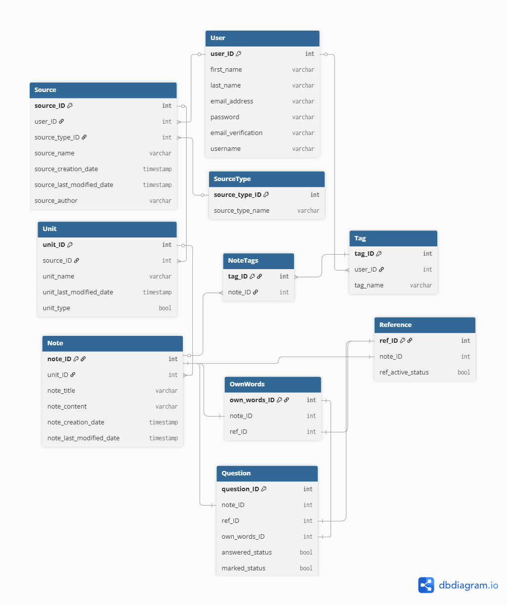

# got it?

## Goals
### Developer Goals:
- to apply lessons learned from previous projects: improve commit messages,
- to develop an application with an intuitive design, never assuming users will know what to do

## User Stories

- **Workflow Theme**
1. As a student, I want a reminder to be selective when writing a reference note, so that I can evaluate whether an idea is worth capturing.
2. As a student, I can create a reference note, so that I can track where my information comes from and return to the source when needed.
3. As a student I want to be asked whether I understood a reference note after saving it, so that I can immediately link it to an own words note, a question note, or defer the decision for later.
4. As a student I want the option to defer the comprehension check on a reference note when I'm not ready to evaluate my understanding, so that I can return to it later without pressure.
5. As a student, I want to link my own-words and question notes to the reference note they stem from, so that I can trace ideas back to their source and evaluate how well I understood them.
6. As a student, I want to be prompted to explain an idea in simple terms when writing an own-words note, so that I am reminded to avoid jargon and test my real understanding.
7. As a student, I want to easily notice which question notes are still unanswered, so that I can prioritize them during revision.
8. As a student I want to be able to check questions as answered after linking them to own words notes, so that I make a conscious decision that the respective idea is understood.
9. As a student I want to be able to differentiate between linked and unlinked reference notes, so that I make the unlinked ones a priority.
10. As a student I want to be able to turn my question notes into own words notes when I find the answers, so that I can work through my understanding.
11. As a student I want to be able to create an own-words note, optionally linked to a reference note, so that I can either process a source or capture my own thinking independently.
12. As a student, I want to create a question note optionally linked to a reference note or an own-words note, so that I can track gaps in my understanding whether they arise from a source or my own thinking.

- **UI/UX Theme**

13. As a new or returning user I want to see a home page that presents the app's value and gives me clear options to sign up or log in so that I can understand what the app offers and easily get started.

Acceptance Criteria:
- AC1: Home page loads without errors - see HP-AT-01
- AC2: User can see a navigation bar with a signup and login link - see HP-AT-01
- AC3: Clicking signup takes the user to the signup page - see HP-MT-02
- AC4: Clicking login takes the user to the login page - see HP-MT-03
- AC5: Logged-in users see a logout link in the navbar instead of sign up and login links - see HP-MT-04

14. As a user I want a dashboard so that I have a central place to access and manage my content

Acceptance Criteria:
- AC1: Page only accessible to logged-in users — unauthenticated users redirected to login -see DP-AT-01 and DP-AT-02;
- AC2: Page shows a list of sources belonging to the logged in user - see DP-MT-03;

15. As a student I want to be able to see a list of all the reference notes, own words notes and question notes related to a particular source, so that I have an ensemble view of what's done and what's left.
16. As a student I want a quick capture option for own words and question notes directly from the dashboard, so that I don't lose a thought while navigating the app.
17. As a student I want to see my most recent activity from the dashboard, so that I can quickly pick up where I left off.
18. As a new user I want to trigger a walkthrough from the home page so that I can understand how the app works before signing up.

19. As a user, I want the app to work on mobile, tablet and desktop, so that I can take notes on any device.

Acceptance Criteria:
- Sidebar is visible by default on desktop → RES-MT-02
- Sidebar is hidden by default on mobile and can be opened via the toggler → RES-MT-03, RES-MT-05
- Toggler is visible on mobile and hidden on desktop → RES-MT-04
- Sidebar sits below the navbar on all screen sizes → RES-MT-07
- No horizontal scrolling on any screen size → RES-MT-01

20. As a student with learning difficulties, I want the app to meet accessibility standards, so that I can use it without barriers.

- **CRUD Functionality Theme**

- **Notes**
21. As a student I want to be able to modify any note, so that I keep my notes up to date with my understanding.
22. As a student I want to be able to delete any of my notes with a confirmation step, so that I can declutter my notes without accidentally losing them.
23. As a student I want to be able to search for a specific note, so that I can easily find one when I need it.

- **Sources**

24. As a student, I want to see all my sources in a list, so that I can navigate to the one I want to work on.

Acceptance Criteria:

- AC1: Only shows sources belonging to the logged-in user - see DP-AT-03 and DP-AT-04
- AC2: Sources listed in reverse chronological order — most recent first - see DP-MT-05
- AC3: Each source shows name,type, author, and date created - see DP-MT-04
- AC4: Each source links to its unit list page
- AC5: Empty state shown when no sources exist, encouraging user to create one - see DP-MT-06

25. As a student, I want to see all the units within a specific source, so that I can navigate to the unit I want to work on

Acceptance Criteria:

- AC1: Page only accessible to logged-in users — unauthenticated users redirected to login - see SDP-AT-01, SDP-AT-02, SDP-MT-01, SDP-MT-02
- AC2: Page only accessible to the source owner — another logged-in user gets a 404 - see SDP-AT-03 and SDP-MT-03
- AC3: If source does not exist, return 404 - see SDP-AT-04
- AC4: Source name and author displayed - see SDP-AT-05
- AC5: Units listed in chronological order — reflecting source structure
- AC6: Each unit shows name and note count
- AC7: Each unit links to its three-column unit page
- AC8: My Thoughts default unit always present
- AC9: Breadcrumbs show Source
- AC10: Edit and delete source actions accessible from this page

26. As a student I want to be able to create a source, so that I can organise my notes around a single book, course, or subject.

Acceptance Criteria:

- AC1: User can enter a source name and a source author - see DP-MT-07;
- AC2: User should select a source type from the available options - see DP-MT-08;
- AC3: Name field cannot be empty — error shown if submitted blank - see DP-MT-09;
- AC4: Source type has to be selected - error shown if not selected - see DP-MT-10;
- AC5: On successful creation user is redirected to the new source detail page - see DP-MT-11
- AC6: A user cannot create two sources with the same name, an error is shown if they try - see DP-MT-12 and DP-AT-06

27. As a student, I want to be able to view all my sources filtered by type, so that I can quickly find material of a specific kind such as all my books or all my lectures.

28. As a student I want to be able to edit a source name, author, or type, so that I can keep it accurate.

Acceptance Criteria:

- AC1: Only accessible to logged-in users - see DP-MT-14
- AC2: Only accessible to the source owner — another logged-in user gets a 404 - see DP-MT-15 and DP-AT-07
- AC3: User can edit source name, author, and type - see DP-MT-16
- AC4: Name field cannot be empty — error shown if submitted blank - see DP-MT-17
- AC5: On successful edit user is redirected back to the dashboard page - see DP-MT-18
- AC6: One type choice has to be selected - error shown if no choice is selected - see DP-MT-19

29. As a student I want to be able to delete a source with confirmation step when I no longer need it, so that my dashboard stays uncluttered.

- AC1: Only accessible to logged-in users
- AC2: Only accessible to the source owner — another logged-in user gets a 404
- AC3: Deleting a source removes it from the sources list
- AC4: User is redirected to the sources page after deletion
- AC5: A confirmation step is required before deletion
- AC6: source name and author appear in confirmation step to avoid confusions
- AC7: A confimation message appears after successful deletion
- AC8: When a source is deleted, all its units and notes are deleted as well

 - **Units**

30. As a student I want to be able to create a unit within a source, so that I can organise my notes by topic.
31. As a student I want to be able to rename a unit, so that I can keep it aligned with my source structure.
32. As a student I want to be able to delete a unit with a confirmation step when I no longer need it, so that I can keep my source structure tidy.

- **Tags**
33. As a student I want to be able to assign one or more tags to a note, so that I can connect related notes across different sources.
34. As a student I want to be prompted with a list of already used tags when tagging a note, so that I keep my tags consistent and avoid duplicates.
35. As a student I want to be able to remove a tag from a note, so that I can correct mistakes or update connections.
36. As a student I want to be able to see all notes associated with a tag in one view, so that I can explore connections between ideas across sources.

- **Authentication Theme**

37. As a new user I want to be able to create a new account, to start using the app.

Acceptance criteria:

- AC1: User can access the signup page - see AUTH-MT-01

- AC2: User must provide a username and password - see AUTH-MT-03 and AUTH-MT-04

- AC3: Error messages are shown for invalid or missing fields - see AUTH-MT-03 to AUTH-MT-07 and AUTH-MT-09

- AC4: User is redirected to dashboard page after successful signup - see AUTH-MT-30

- AC5: Password must meet minimum security requirements (length, complexity) - see  AUTH-MT-10 to AUTH-MT-13

38. As a user I want to be able to sign into my account, to be able to access my notes and create new ones.

Acceptance criteria:

- AC1: User can access the signin page - see AUTH-MT-02

- AC2: User can sign in with valid credentials - see AUTH-MT-16

- AC3: Error shown for incorrect password - see AUTH-MT-17

- AC4: Error shown for unregistered email/username - see AUTH-MT-18

- AC5: Error shown for missing fields - see AUTH-MT-19 and AUTH-MT-20

- AC6: User is redirected to dashboard on successful signin - see AUTH-MT-16

- AC7: User remains on signin page if login fails - see AUTH-MT-17 to AUTH-MT-20

39. As a user, I want to log out of my account so that I can securely end my session.

Acceptance criteria:

- AC1: User can see a logout link on the dashboard - see DP-MT-01

- AC2: Clicking logout ends the user's session - see AUTH-MT-21

- AC3: User is redirected to the home page after logging out - see AUTH-MT-31

- AC4: User cannot access the dashboard after logging out - see AUTH-MT-22 and AUTH-MT-32

40. As a user I want to be able to reset my password, so as not to lose access to my account when I forget it.

41. As a user I want to stay logged in between sessions, so that I don't have to sign in every time.

Acceptance criteria:

- AC 1: User sees a "Remember Me" checkbox on sign in page - see AUTH-MT-23

- AC 2: When a user logs in with "Remember me" checked, their session persists after closing and reopening the browser - see AUTH-MT-24

- AC 3: When a user logs in without "Remember me" checked, their session ends when the browser is closed - see AUTH-MT-26

- AC4: After a defined period of inactivity, the session expires and the user is prompted to log in again, even if "Remember me" was checked - see AUTH-MT-27

- AC5: The user can manually log out at any time, which ends the session immediately regardless of "Remember me" - see AUTH-MT-28

42. As a user I want to be able to delete my account with confirmation step when I consider I don't need it anymore, so that I can be in control of my information.
43. As a new user I want to verify my email address after registering, so that my account is secure and recoverable.

## ERD
Entity Relationship Diagram showing the core data structure: User, Source, Source Type, Unit, Note, Tags, Note Tags, Reference, Own-Words and Questions.

## Development Process (Agile Workflow)

1. Check the user story;
2. Write acceptance criteria and tasks if not already in issue;
3. Move to respective iteration if not already there;
4. Move to In Progress in Project Board;
5. Write acceptance criteria in README user story;
6. Plan the code;
7. Write code;
8. Write automated tests;
9. Run automated tests, fix if failing, and document in TESTING.md;
10. Write manual tests in TESTING.md;
11. Link tests with acceptance criteria in README;
12. Update README if any decisions were made;
13. Move issue to done on project board;
14. Commit;

## Design Decisions

### Navigation & Layout

- Persistent sidebar with two sections separated by a horizontal rule: organisational (Sources, Units) and note types (Reference, My Words, Questions)
- ... dropdown for edit/delete actions on list items, keeping lists clean
- Arrow indicator on list rows to signal they are clickable links
- Unit detail uses Bootstrap tabs (Reference, My Words, Questions) with full-width content area per tab
- Sidebar on note detail pages provides navigation back to unit context

### Notes Display

- Reference notes displayed as Bootstrap card grid (3 columns, h-100 for equal height)
- Cards show title and truncated content preview only
- Evaluated/Pending distinction: green border = evaluated, blue border = pending
- Filter on Reference and Questions tabs: All / Evaluated / Pending (References), All / Answered / Unanswered (Questions)

### Note Relationships

- Reference notes have one-to-many relationship with My Words and Question notes
- Foreign key to parent reference note is nullable — My Words and Question notes can exist independently within a unit (linked to source and unit but not to a specific reference note)
- Answered questions link to one or more My Words notes

### Modals vs Full Pages

- Modals: create/edit source, create/edit unit, delete confirmations
- Full pages: create, read, edit individual notes
- Rationale: notes deserve space and focus; modals suit quick transactional actions

### Terminology

- Consistent naming throughout: Reference, My Words, Questions
- E- valuated/Pending for reference note status
- Answered/Unanswered for question status

### Visual Identity

- Single green accent colour throughout
- "got it?" logo as branding in navbar
- "got it?" logo reused as pending/unanswered indicator on note detail pages
- Bootstrap defaults otherwise — minimal additional styling

### Internationalisation (i18n)
While overriding allauth templates, I came across the i18n library and had to decide whether to implement it across all my templates or remove it from the authentication ones for consistency. Although a note-taking app would benefit from it, this being my first Django project, I considered internationalisation an unnecessary overhead at this stage and added it to the future features list instead.

## Accessibility
## Accessibility
- The offcanvas sidebar includes a visually hidden heading so screen readers can identify the region when it opens.
- The sidebar's top offset and height are calculated at runtime via JavaScript rather than hardcoded, so the layout remains correct if a user increases their font size or zoom level.

## Features
### Security and Data Protection Features:
- Rate limiting (control of how many requests a user/IP can make to an app within a certain time period) provided by Django allauth;
- Account enumeration prevention (stops attackers from figuring out which email addresses/usernames are registered in an app by giving intentionally vague error messages) provided by Django allauth;

### Future features
- Social authentication (Google, GitHub) planned as a future enhancement using django-allauth's built-in social providers
- Internationalisation (i18n) support for multi-language translations using Django's built-in i18n framework

## Future Improvements
- Extend source uniqueness constraint to include 'source_author' and 'source_type' to handle edge cases where same title exists across different authors or formats

## Deployment
### Prerequisites
- Heroku account
- GitHub accout
- Git installed locally
- gunicorn latest version installed locally and added to requirements.txt

### Files Required
- Procfile in the root directory of your project containing the command that Heroku will use to start the server:
 web: gunicorn your-project.wsgi

### Steps
1. Create the Heroku app: sign into your Heroku account, navigate to your dashboard and create a  new app with a unique name;
2. In your app click on the Deploy tab;
3. In the Deployment method section enable GitHub integration by clicking on Connect to GitHub. You may be asked to authenticate with GitHub if this is the first project you deploy with GitHub;
4. In the Search box start typing the name of your project and choose it from the list displayed;
5. Scroll to the bottom of the page and click Deploy Branch to start a manual deployment of the main branch.
6. Click on Open App to view your deployed project;

## Technologies Used
- SVG icons from Bootstrap icons were used inline rather than an icon font library, for reliability and to avoid an additional dependency.