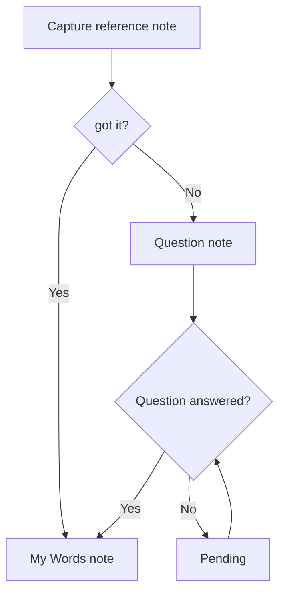
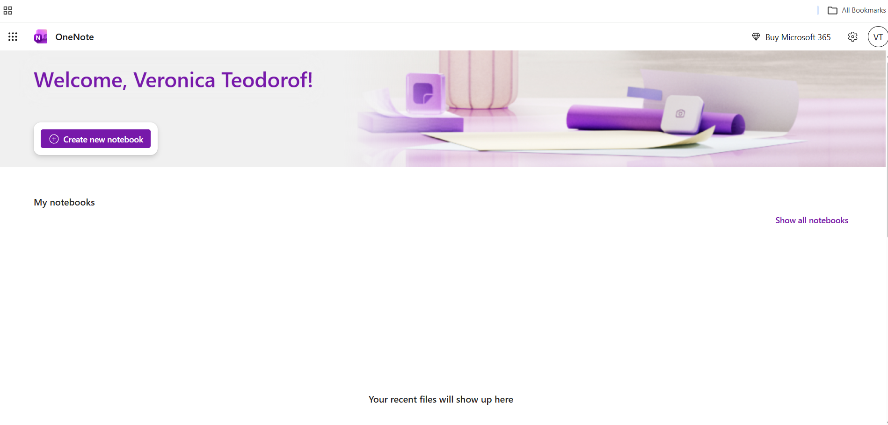
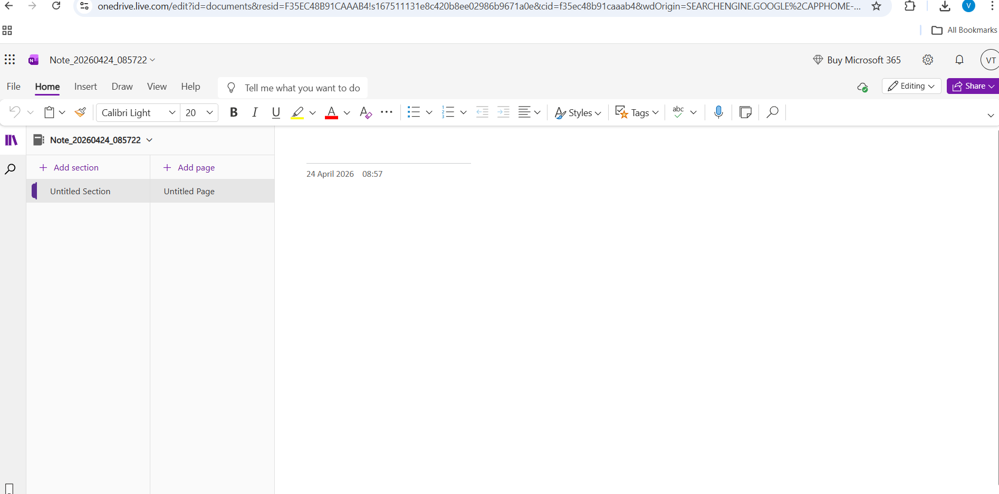
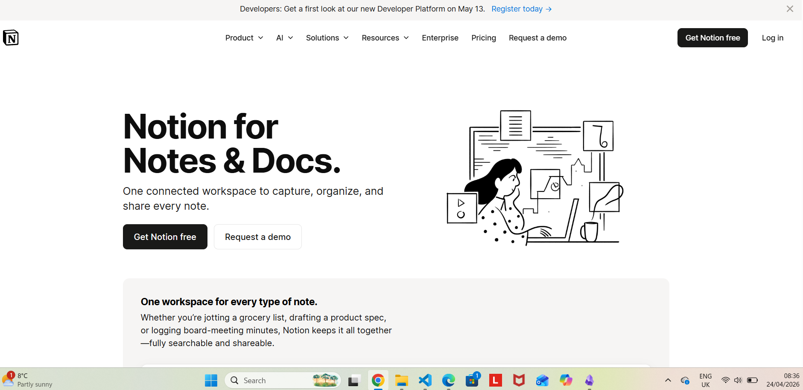
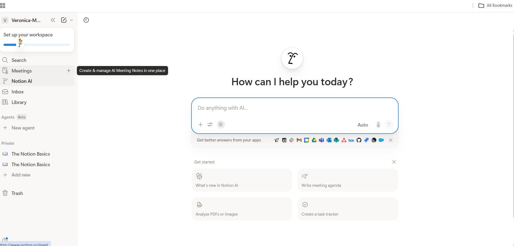
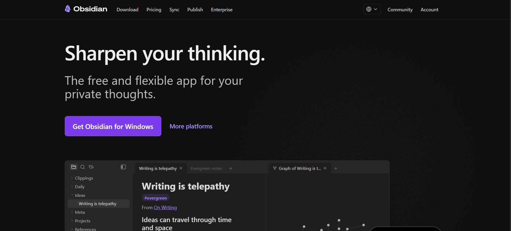
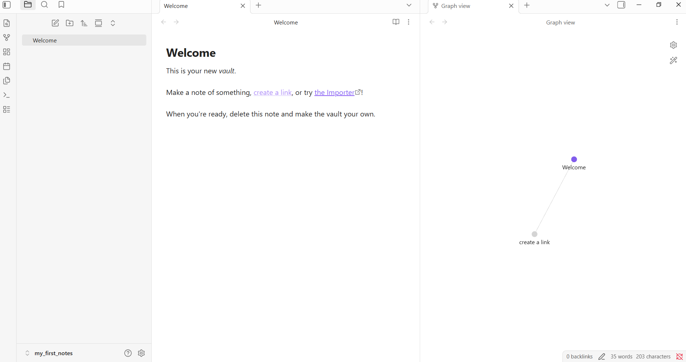
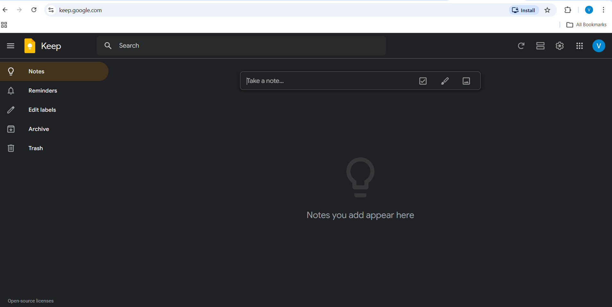
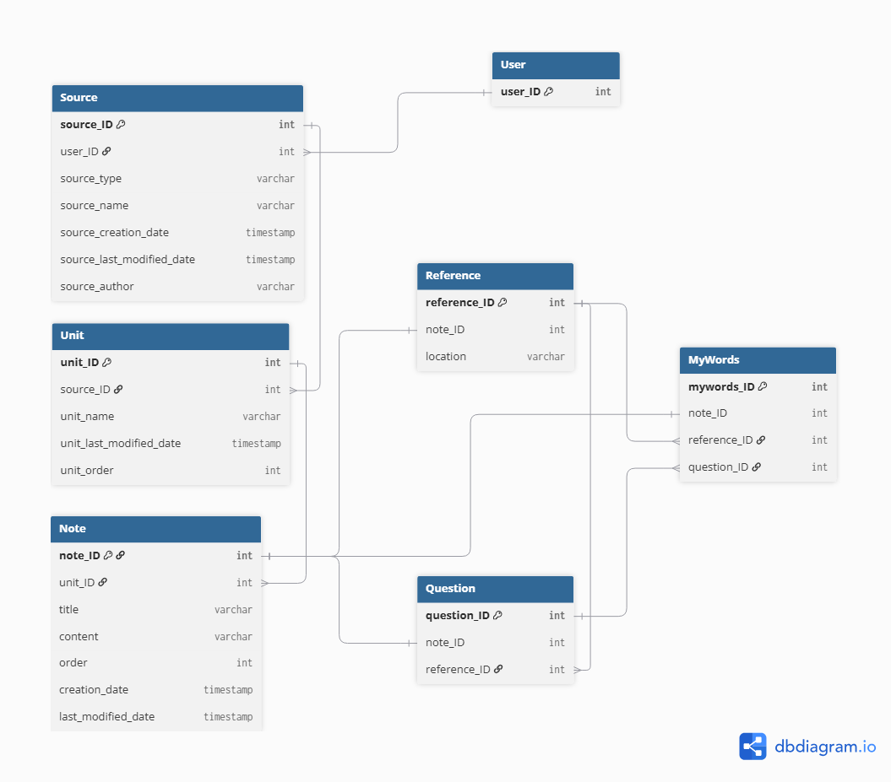

# got it?

Live link: https://got-it-296cde7d011a.herokuapp.com/

"got it?" is a note-taking and learning companion prototype app, built to test whether a specific, not imposed workflow resonates with users — whether people actually find it useful and helpful in the way they learn.

This workflow is derived from the Feynman Technique, which is a simple way of testing whether you actually understand something: if you can explain it in your own words - no jargon, no repeating the original phrasing - as if to someone who's never come across it, you understand it. If you can't, you don't. The idea maps directly onto two distinct note types in this app, while a third note type is an original extension:

- Reference notes capture the raw idea or the original wording, kept as a bibliographic anchor;
- My Words notes - your attempt at the explanation itself: the same idea, rebuilt in your own plain language.
- Question notes - a third note type meant to capture and make you aware of your gaps in understanding, which is arguably more important than being aware of what you already know and understand. By writing it down, you make sure it doesn't quietly disappear.

The rest of this document walks through how that workflow was designed and built, loosely structured around the five planes of UX, with some references to how some planes connects to corresponding backend decisions, rather than the chronological order of development. This was a learn-as-you-build project and learning can be quite messy; the document tries to bring some order into chaos, and why not, be a blueprint for the development lifecycle of future projects.

## Strategy
**Origin**
The idea for this app began with a personal need: organising thoughts and external information - a problem generally addressed by Personal Knowledge Management (PKM) tools. This led to reading <em>How to Take Smart Notes</em> by Sonke Ahrens (2017), which introduced me to the Zettelkasten method: organizing notes into **reference notes** (captured from sources) and **permanent notes** (the reader's own ideas and insights, inspired by a source, but independent of it, with a citation back to the original).

The initial idea was to build something similar to Obsidian, one of the most popular implementations of the Zettelkasten system. When I discovered it already existed, I thought about simplifying it, as it felt too complex, one needed to digest it first. Instead of a system for connecting thoughts and ideas, I would turn it into a tool for assessing the understanding of what is being read, which is simpler to grasp and can be used by younger users as well, particularly secondary school students.

A second observation that reinforced this direction came from my experience as a student in an online, mostly self-guided course. I often find myself reflecting on what I want to ask or what I didn't understand just before the session. One week of self-guided study must generate a lot of questions, but without a routine for capturing them they may go unacknowledged, unformed or unwritten.

This too pointed to the need for a structured way to capture thoughts while learning - with clear decision points that make understanding, or the lack of it, explicit.

**Hypothesis**

This would be the core of my app:

```mermaid
graph TD
    A[Capture reference note] --> B{got it?}
    B -->|Yes| C[My Words note]
    B -->|No| D[Question note]
    D --> F{Question answered?}
    F -->|Yes| C
    F -->|No| G[Pending]
    G --> F
```

**Adopted**
- The idea of distinguishing between different types of notes, adopted from the Zettelkasten system
- The principle of imposing a structured workflow on the note-taking process, adopted from Cornell Notes

**Adopted and verified by existing research**
- Checking understanding by summarising in your own words: if you can explain something simply, you understand it; if you can't, you don't, adopted from the Feynman Technique

**Adapted**
- Literature notes in Zettelkasten system become two types of notes in my app: reference notes and own words notes.

**Extended - product hypothesis, not yet validated**
- A third note category: **question notes** — an explicit, conscious decision to flag something as not yet understood, rather than leaving gaps implicit.

The core hypothesis of this app remains untested. Rather than treat this as a limitation to work around, it defines what this project actually is: not a finished note-taking app, but the vehicle that will be used to test the hypothesis with real users, once it exists. The main target audience would be secondary school students and above (although the workflow is applicable to any independent learner engaging with source material).

**Market Research for Landing and Dashboard/Editor**

Before scoping the application I did a quick market research to understand what existing products have to offer and what note-taing app users expect from such tools.I selected four apps representing different approaches to note-taking: a mainstream all-rounder, an AI-first workspace, a linked-thinking tool, and a minimal capture app.
1. OneNote - mainstream app: https://onenote.cloud.microsoft/

Home Page:

Dashboard:

2. Notion - AI-first, workspace/productivity oriented: https://www.notion.com/notes

Home Page:

Dashboard:

3. Obsidian -  Zettelkasten, linked thinking,: https://obsidian.md/

Home Page:

Dashboard:

4. Google Keep - minimal: https://keep.google.com/

Dashboard:

To complement the visual research, I also drew on an the article: "Digital Note-Taking: A UX Research Case Study" https://medium.com/@garimamour10/digital-note-taking-a-ux-research-case-study-c5cee728dc8d, and an AI overview, to further inform my design decisions.

**Key Takeaways**

Note-taking app users expect:
- a minimalist UI,
- a search feature,
- organization by course, or subject, or topic,
- a quick capture mechanism,
- recent notes visibility.

A fully scoped application would consider implementing all the features above. The MVP, however, is deliberately narrower: it will contain the comprehension workflow itself, the organization by course/subject wrapped-up in a minimalist UI, and authentication. The remaining features -  search, full quick-capture, tagging — are left for future iterations.

## Scope

### User Stories

**Authentication Theme**

1. As a new user I want to be able to create a new account, to start using the app.

Acceptance criteria:

- AC1: User can access the signup page

- AC2: User must provide a username, password, email

- AC3: Error messages are shown for invalid or missing fields

- AC4: User is redirected to dashboard page after successful signup

2. As a user I want to be able to sign into my account, to be able to access my notes and create new ones.

Acceptance criteria:

- AC1: User can access the signin page

- AC2: User can sign in with valid credentials

- AC3: Error shown for incorrect password

- AC4: Error shown for unregistered email/username

- AC5: Error shown for missing fields

- AC6: User is redirected to dashboard on successful signin

- AC7: User remains on signin page if login fails

3. As a user, I want to log out of my account so that I can securely end my session.

Acceptance criteria:

- AC1: User can see a logout link on the dashboard

- AC2: Clicking logout ends the user's session

- AC3: User is redirected to the home page after logging out

- AC4: User cannot access the dashboard after logging out

4. As a user I want to stay logged in between sessions, so that I don't have to sign in every time.

Acceptance criteria:

- AC1: User sees a "Remember Me" checkbox on sign in page

- AC2: When a user logs in with "Remember me" checked, their session persists after closing and reopening the browser

- AC3: When a user logs in without "Remember me" checked, their session ends when the browser is closed

- AC4: After a defined period of inactivity, the session expires and the user is prompted to log in again, even if "Remember me" was checked

- AC5: The user can manually log out at any time, which ends the session immediately regardless of "Remember me"

 

**Structure**
- **Sources**

5. As a learner, I want to see all my sources in a list, so that I can navigate to the one I want to work on.

Acceptance Criteria:

- AC1: Only shows sources belonging to the logged-in user
- AC2: Sources listed in reverse chronological order — most recent first
- AC3: Each source shows name,type, author, and date created
- AC4: Each source links to its unit list page
- AC5: Empty state shown when no sources exist, encouraging user to create one

6. As a learner I want to be able to create a source, so that I can organise my notes around a single book, course, or subject.

Acceptance Criteria:

- AC1: User can enter a source name and a source author
- AC2: User should select a source type from the available options
- AC3: Name field cannot be empty — error shown if submitted blank
- AC4: Source type has to be selected - error shown if not selected
- AC5: On successful creation the new sources is appended to the list in dashboard and 'Source added' message shown
- AC6: A user cannot create two sources with the same name, an error is shown if they try

7. As a learner I want to be able to edit a source name, author, or type, so that I can keep it accurate.

Acceptance Criteria:
- AC1: User can edit source name, author, and type
- AC2: Name field cannot be empty — error shown if submitted blank
- AC3: On successful edit 'Edit saved' message is shown
- AC4: One type choice has to be selected - error shown if no choice is selected

8. As a learner I want to be able to delete a source with confirmation step when I no longer need it, so that my dashboard stays uncluttered.

- AC1: Only accessible to logged-in users; unauthenticated user is redirected to login page
- AC2: Only accessible to the source owner — another logged-in user gets 404
- AC3: Deleting a source removes it from the sources list
- AC4: User is redirected to dashboard after deletion
- AC5: A confirmation step is required before deletion
- AC6: Source name and author appear in confirmation step to avoid confusions
- AC7: A confimation message appears after successful deletion
- AC8: When a source is deleted, all its units and notes are deleted as well

 - **Units**

 9. As a learner, I want to see all the units within a specific source, so that I can navigate to the unit I want to work on

Acceptance Criteria:

- AC1: Page only accessible to logged-in users — unauthenticated users redirected to login
- AC2: Page only accessible to the source owner — another logged-in user gets a 404
- AC3: If source does not exist, return 404
- AC4: Source name and author displayed
- AC5: Units listed in most recent edited order
- AC6: Each unit shows name
- AC7: Each unit links to its three-tabs unit page
- AC8: Only and all units belonging to current source are displayed in the list of units
- AC9: Empty state shown when no unitss exist, encouraging user to create one

10. As a learner I want to be able to create a unit within a source, so that I can organise my notes by topic.

Acceptance Criteria:

- AC1: Create unit button is present on source detail page
- AC2: Clicking create unit button will expand the create unit form
- AC3: Save and Cancel buttons are present on create unit form
- AC4: Cancel button collapses and resets the form
- AC5: User can enter a unit name
- AC6: Name field cannot be empty — error shown if submitted blank
- AC7: On successful creation unit is shown in units list and success message appears
- AC8: A user cannot create duplicate name units within a source -  an error is shown if they try
- AC9: When there are errors on the form, page loads with expanded form so feedback is immediately visible

11. As a learner I want to be able to rename a unit, so that I can keep it aligned with my source structure.

Acceptance Criteria:
- AC1: Edit button present in dropdown
- AC2: Clicking Edit button loads edit mode
- AC3: Edit form is prepopulated with correct data
- AC4: User can edit unit name in form
- AC5: Save and Cancel icons present on the form
- AC6: Submitting empty unit name field rerenders the form with errors
- AC7: Submitting form with valid data saves the form and reloads page non-editable
- AC8: Submitting the form with duplicate name rerenders the form with error

12. As a learner I want to be able to delete a unit with a confirmation step when I no longer need it, so that I can keep my source structure tidy.

Acceptance Criteria:
- AC1: Delete button present on inline dropdown
- AC2: Clicking delete button opens a confirmation modal
- AC3: Confirmation modal has source and unit names included along with risks warnings, so that user does not accidentaly delete wrong unit
- AC4: Delete and Cancel buttons present on modal
- AC5: Delete button deletes unit, closes modal and rerenders page with updated units list
- AC6: Cancel button closes modal
- AC7: Page accessible to logged in owners, unauthenticated users are redirected to login
- AC8: Trying to access an inexisting unit gives 404

- **Notes**

 
13. As a learner, I want to see all my notes within a unit in one view, so that I can review everything I've captured for that topic in one place.

Acceptance Criteria:

- AC1: Page only accessible to logged-in users — unauthenticated users redirected to login
- AC2: Page only accessible to the unit's owner — another logged-in user gets a 404
- AC3: If unit does not exist, return 404
- AC4: Notes are organised into three tabs — Reference, My Words, Question
- AC5: Each tab shows only notes of that type belonging to the current unit
- AC6: Active tab persists via URL hash, so refreshing or sharing the link keeps the same tab open
- AC7: Notes within each tab are paginated independently of the other tabs
- AC8: Empty state shown per tab when no notes of that type exist, encouraging user to create one

14. As a learner, I want to view a note's full detail on its own page, so that I can read or work with it without distraction from other notes.

Acceptance Criteria:

- AC1: Page only accessible to logged-in users — unauthenticated users redirected to login
- AC2: Page only accessible to the note's owner — another logged-in user gets a 404
- AC3: If note does not exist, return 404
- AC4: Note detail page displays all fields relevant to its type
- AC5: Breadcrumb navigation shows the note's position within its source and unit

 
15. As a learner, I want to edit a note, so that I can correct or improve it after creating it.

Acceptance Criteria:

- AC1: Edit option accessible from the note detail page
- AC2: Edit form is prepopulated with the note's current content
- AC3: Required fields cannot be submitted empty — error shown if attempted
- AC4: On successful edit, updated content is displayed and a confirmation message is shown
- AC5: Only the note's owner can edit it — another logged-in user gets a 404
- AC6: Cancelling an edit returns the user to the note detail page without saving changes

16. As a learner, I want to delete a note with a confirmation step, so that I don't lose it by accident but can remove it when no longer needed.

Acceptance Criteria:

- AC1: Delete option accessible from the note detail page
- AC2: Clicking delete opens a confirmation step
- AC3: Confirmation step names the note (or shows a preview of its content) to avoid accidental deletion of the wrong note
- AC4: Confirm and Cancel options are both present
- AC5: Confirming deletion removes the note and redirects to the unit's note list
- AC6: A confirmation message is shown after successful deletion
- AC7: Only the note's owner can delete it — another logged-in user gets a 404

 

**Workflow Theme**

17. As a learner, I want to create a reference note within a Unit, so that I can capture source material I'm studying before I paraphrase or question it.

Acceptance Criteria:
- AC1: User can select "create reference note" from a Unit's detail page or from the sidebar
- AC2: Form displays with the required content field
- AC3: Submitting valid content saves the note and loads note's detail page
- AC4: Newly created note appears in Unit detail page in Reference panel, with "Unlinked" status badge
- AC5: Submitting empty/invalid content displays a clear error message
- AC6: Selecting "cancel" returns the user to the previous page without creating a note

18. As a learner, I want to create a MyWords note either linked to a reference note, so that I can paraphrase source material in my own words as part of engaging with it actively or standalone to capture links with prior learning or reading.

Acceptance Criteria:
- AC1: User can create a linked My Words note from Reference detail view
- AC2: When creating a linked My Words note, Reference note appears collapsed on create page
- AC3: User can create a standalone My Words note from unit detail page or from sidebar
- AC4: Submitting valid form creates and displays note detail page
- AC5: Newly created note appears in Unit detail page in My Words panel, with origin badge
- AC6: When new note was created from Reference, the status of the latter updates to linked
- AC7: Submitting invalid form displays a clear error message
- AC8: Selecting "cancel" returns the learner to the previous page without creating a note

19. As a learner, I want to create a Question note either standalone or linked to a reference note, so that I can capture questions that arise as I engage with source material.

Acceptance Criteria:
- AC1: User can create a linked Question note from Reference detail view
- AC2: When creating a linked Question note, Reference note appears collapsed on create page
- AC3: User can create a standalone Question note from unit detail page or from sidebar
- AC4: Submitting valid form creates and displays note detail page
- AC5: Newly created note appears in Unit detail page in My Words panel, with origin badge
- AC6: Newly created note appears in Unit detail page in Question panel, with 'Unanswered' status badge
- AC7: When new note was created from Reference, the status of the latter updates to linked
- AC8: Submitting invalid form displays a clear error message
- AC9: Selecting "cancel" returns the learner to the previous page without creating a note

20. As a learner, I want to answer a Question note by creating a linked MyWords note, so that I can resolve my questions by working through them in my own words.

Acceptance Criteria:
- AC1: User can select Answer in My Words from a Question detail view which leads to creating a new My Words note related to Question
- AC2: Both the Reference note that spawned the Question and the Question are present collapsed on the My Words create page
- AC3: Once linked, the Question note's status badge updates from "Unanswered" to "Answered"
- AC4: Once created, the MyWords note's origin badge displays 'From Question'

21. As a learner, I want to view all notes linked from a reference note on its detail page, so that I can see how I've already engaged with that source material.

Acceptance Criteria:
- AC1: Reference note detail page displays a list of linked MyWords notes, if any
- AC2: Reference note detail page displays a list of linked Question notes, if any
- AC3: Each linked note displays enough info (e.g. snippet, type) to identify it without opening it
- AC4: Selecting a linked note navigates to its detail page

22. As a learner, I want to view the notes linked to a Question note on its detail page, so that I can see how I answered my question.

Acceptance Criteria:
- AC1: Question note detail page displays the linked MyWords note(s), if any
- AC2: Each linked note displays enough info (e.g. snippet) to identify it without opening it
- AC3: Selecting a linked note navigates to its detail page

 

 **UI/UX Theme**
 

 
23. As a new or returning user I want to see a home page that presents the app's value and gives me clear options to sign up or log in so that I can understand what the app offers and easily get started.

Acceptance Criteria:
- AC1: Home page displays the app's value proposition (tagline/headline)
- AC2: Home page displays a "How it works" explanation of the note-taking flow
- AC3: Home page displays a primary "Get started" CTA
- AC4: Clicking 'Get started' link navigates to Sign up page
- AC5: Home page footer displays attribution and relevant links

24. As a learner, I want a walkthrough of the app's structure and workflow, so that I understand how it works before I start creating content.

Acceptance Criteria:
- AC1: Walkthrough explains the Source → Unit → Note hierarchy
- AC2: Walkthrough explains the three note types and their purpose
- AC3: Walkthrough is accessible from main navigation at any time
- AC4: Empy states support user experience by explaining the role of each piece of structure or workflow

25. As a developer, I want to collect user feedback via an external Google Form, so that I can gather insight on usability and prioritize future improvements.

Acceptance Criteria:
- AC1: Feedback link/button is visible and accessible from key pages (e.g. footer or nav)
- AC2: Link opens the Google Form in a new tab, preserving the user's place in the app

26. As a learner, I want navigation that reflects the app's structure, so that I always know where I am and how to get back to where I came from.

Acceptance Criteria:
- AC1: Main navigation is present and consistent across all pages
- AC2: External links to open in another tab so I don't navigate away from the app
- AC3: Breadcrumbs reflect the current Source/Unit context
- AC4: Sidebar provides persistent access to the learner's structure
- AC5: Back-navigation is available wherever a user might need to retrace a step

27. As a learner, I want the app to be usable with assistive technology, so that I'm not excluded from using it regardless of ability.

Acceptance Criteria:
- AC1: All pages pass Lighthouse accessibility audit (target: 100)
- AC2: Interactive elements have appropriate ARIA roles/labels
- AC3: Live regions announce dynamic content changes
- AC4: Color contrast meets standard minimum throughout

28. As a learner, I want the app to work well on any device, so that I can study on whatever I have to hand.

Acceptance Criteria:
- AC1: Layout adapts cleanly across mobile, tablet, and desktop breakpoints
- AC2: No horizontal scroll caused by content overflow (e.g. long unbroken strings)
- AC3: Navigation collapses to an appropriate mobile pattern (e.g. offcanvas)
- AC4: Touch targets are appropriately sized on smaller screens

29. As a learner, I want a clean, uncluttered interface, so that I can focus on the content I'm studying without distraction.

Acceptance Criteria:
- AC1: Pages avoid unnecessary visual elements that don't support the task at hand
- AC2: Consistent, restrained color and typography system throughout
- AC3: Calls-to-action are visually clear without relying on excessive decoration

### Features
- Authentication: stories 1–4
- Structure: stories 5–16 (Sources, Units, Notes CRUD + list views)
- Comprehension Workflow: stories 17–22 (reference/MyWords/Question creation, answering, viewing links)
- Home Page: story 23
- Walkthrough: story 24
- Feedback Form: story 25
- Navigation: story 26

**Non-functional requirements**

- Minimalist UI:story 29
- Responsiveness:story 28
- Accessibility: story 27

## Structure

Structure, in this project, covers both the user-facing organization of features and the underlying architecture that supports it - the two are treated together here since app organization mirrors the same grouping logic as the feature themes established in Scope.

### Features -> Apps

- Authentication (stories 1–4) -> project level (django-allauth)
- Structure + Comprehension Workflow (stories 5–22) -> `notes` app ( these two features map to one codebase app, as they share the same models, so splitting them wouldn't reduce coupling, just add import overhead)
- Home Page / Walkthrough -> `pages` app
- Feedback (story 25) -> a link in main navigation (base.html), pointing to an external Google Form — no dedicated view or app
- Navigation (story 26) -> split into layers, each detailed below, spanning multiple templates and views rather than a single app

### Data Schema
"got it?" is built around a three-level hierarchy: Source -> Unit -> Note, reflecting how study material is naturally organised - a source (a book, course, or website) is broken into units (chapters, modules), and each unit holds the notes taken while studying it.

**Source**

The top-level container - the bibliographic reference itself. Each source belongs to a single user and has a source_type (one of eight choices: Course, Book, Website, Video, Podcast, Documentation, Article, Other), a name, and an optional author (some source types, like websites, genuinely have no author - hence null=True and blank=True on source_author field).
A user cannot have two sources with the same name - this is enforced at the database level, not just through the form, so it holds even if validation is bypassed. Deleting a user deletes all of their sources.

**Unit**

A second-level container living inside a source - typically a chapter, module, or section. A source cannot have two units with the same name, though the same unit name can exist across different sources.
Deleting a source deletes all of its units (on_delete=CASCADE). This is a deliberate design choice, Unit.source is a required field (null=False) - a unit cannot exist without belonging to a source, since a unit only has meaning as a subdivision of something. If cascade wasn't used here, the only other viable option would be: PROTECT which would block the source from being deleted at all while it still has units, forcing the user to manually delete every unit first. This would add friction to the app resulting in bad user experience.

**Note**

Notes are the actual content layer, and always belong to a unit. There are three types, built on a shared abstract base with title, content and timestamps. (The idea of building them on an abstract inheritance model belongs to my tutor.)

- Reference — captures material directly from the source: a quote, a definition, a key passage. Can optionally record a location (page number, timestamp, URL).
- MyWords — the user's own explanation or restatement of an idea, or relates current with prior study material or reading.
- Question — captures a gap in understanding, or an original question prompted by the material.

**Note relationships**

MyWords and Question notes can be created from a Reference - capturing an idea in the source material, then explaining it in the user's own words or raising a question about it. MyWords notes can also be created from a Question - an answer written in response to a gap in understanding. Both My Words and Question can also be created as standalone notes - hence model level decision of having the reference FK with null = True and blank = True.

Why ForeignKey, not OneToOne: a single Reference can reasonably need more than one MyWords or Question note - a reference might capture more than one idea (though not recommended), the same idea might be rephrased in several different ways as understanding develops, or it might raise more than one question. Likewise, a single Question can have more than one MyWords answer, since a question might be revisited and answered again as understanding improves. A one-to-one relationship would force exactly one explanation or question per reference, and exactly one answer per question - which doesn't reflect how learning and revisiting material actually works. ForeignKey allows many notes to originate from the same reference or question, which is the more accurate model.

Deleting a Reference or Question does not delete the notes created from it - the link is simply cleared (on_delete=SET_NULL), and the dependent note becomes a standalone, unlike Source->Unit and Unit->Note above. This is intentional: unlike a unit without a source, a MyWords or Question note is still meaningful content on its own even if the reference or question it originated from is later removed — the user's thinking shouldn't be deleted just because its starting point was.

The above schema was built using the Hernandez methodology, as described in `Database Design for Mere Mortals` by Michael J. Hernandez— likely overkill for a project this size, but chosen out of a combination of wanting to be thorough about getting the models right, and personal curiosity about the methodology itself. This was my own initiative rather than something suggested by my tutor. The full process is described in [RESEARCH.md](RESEARCH.md) and [field specifications](docs/field-specifications.md).

### ERD
Entity Relationship Diagram showing the core data structure: User, Source, Unit, Note, Reference, MyWords and Question.

### Navigation
Navigation is split into eight layers, each addressing a different need:
- Navigation to external pages via footer links and give feedback link in main navbar - base.html (project level)
- Main nav - global, project-level actions (home, feedback, dashboard, log out) - base.html (project level)
- Secondary back-navigation (mobile only) — a step-back affordance for small screens, where the content sidebar isn't always visible on screen - `notes` app templates level
- Sidebar / offcanvas - the Source->Unit content structure, and in Notes level pages also displaying links to the three note type tabs and standalone creation - reachable without losing your place - `notes` app partial
- Breadcrumbs — orientation: shows exactly where you are and the path you took to get there - `notes` app template level
- Note-type tabs — switching between Reference/My Words/Questions within a unit, without page reloads, with state synced to the URL hash so a direct link or refresh lands on the right tab - `notes` app Unit detail template
- Pagination - sequential navigation within long lists - `notes` app template level
- Relational linking — lets a user jump directly between related notes (e.g. from a reference to its linked My Words or Questions) rather than following the strict Source → Unit → note-type path, so related ideas stay reachable regardless of where the user currently is in the hierarchy - `notes` app template level

## Development Process (Agile Workflow)

1. Check the user story;
2. Write acceptance criteria and tasks if not already in issue;
3. Move to respective iteration if not already there;
4. Move to In Progress in Project Board;
5. Write acceptance criteria in README user story;
6. Plan the code;
7. Write code;
8. Write automated tests;
9. Run automated tests, fix if failing, and document in TESTING.md;
10. Write manual tests in TESTING.md;
11. Link tests with acceptance criteria in README;
12. Update README if any decisions were made;
13. Move issue to done on project board;
14. Commit;

## Design
### Notebook esthetics
- Early versions used django-crispy-forms; I later switched to custom form templates to match the app's notebook style.

## Implementation details

**Handling two forms in one view**
source_detail manages both the source-edit form and the add-unit form on a single page. Each POST is distinguished via a hidden form_type field. Whichever form isn't being submitted is reconstructed unbound (using existing instance data where relevant) so both forms render correctly regardless of which one was actually processed (pattern suggested and given by Claude AI),

## Design Decisions

### Onboarding through empty states

Empty states are treated as onboarding moments rather than placeholders — each one teaches the user what to do next and why, instead of just indicating that content is missing, reinforcing the app's structure and pedagogy at the exact moment it's relevant.

- **Sidebar reflects data existence** — the sidebar stays empty on first interaction, since the dashboard's primary call-to-action is the sole entry point for a new user; showing sidebar content with nothing to navigate would compete with that and add confusion rather than help.

### Navigation Architecture
**Problem**
The original mobile layout used a single unlabeled forward arrow to open the offcanvas navigation. This created a real usability gap: nothing on the page told users how to get back to the sources list. The arrow itself pointed forward, so even users who tried it for that purpose were working against its visual meaning, and there was no separate, correctly-oriented control for returning to a previous page at all. Users had no reliable way to navigate back.

**Goals:**

- Make every navigation control state where it leads.
- Avoid redundant navigation paths (the same destination reachable two different visible ways on the same screen).
- Reflect the app's actual hierarchy (Source → Unit → Note) rather than imposing a flat menu that implies destinations aren't really reachable.
- Scale gracefully from mobile to desktop without maintaining two unrelated navigation systems.

**Approach considered and rejected: persistent icon rail**
An early option was a slim, always-visible sidebar with single-letter abbreviations (S / U / N) for Sources, Units, Notes. This was rejected because:

Notes aren't reachable without first selecting a Unit, so a flat S/U/N rail would need disabled/dimmed states at shallower depths, which adds complexity without adding real navigation.
The rail's contents would need to change shape depending on the current page (dashboard vs. source detail vs. unit detail), undermining the consistency it was meant to provide.

**Final approach: two-tier navigation + depth-aware menu**
Top navbar (unchanged): brand mark, Home, Dashboard, Log out. Persistent across all pages and breakpoints.
Mobile: second nav bar, directly below the top navbar, contextual per page:

Left: a single labelled back-link combining "go up" and "go to creation" into one destination, since both land on the same list/index page (e.g. "Change source or add one", "Change unit or add one", "Change note or add a new one"). On the new-note page specifically, this becomes "View all notes", since there's nothing yet to "change."
Right (only on pages with more than one add-action or a multi-level jump need): "Menu" + hamburger icon, opening a Bootstrap offcanvas.

Offcanvas menu appears only from Unit detail downward, since that's the point where a single inline button can no longer represent all available content types. It groups:

Navigation shortcuts to jump more than one level up (Sources, Units).
Add-actions per content type (Sources, Units, Reference, Own words, Questions).

Source detail and Dashboard don't need the menu. For Source detail its only one-level-up path is inline, as are all available actions (single "Create unit" button, three-dot dropdown for edit/delete).
Inline actions (three-dot dropdown for edit/delete) are used consistently at every depth next to the relevant title (source title, unit title), rather than living in the menu, since edit/delete apply to "the thing I'm looking at," not "something I want to navigate to."
Desktop: the second nav bar and offcanvas are replaced by a permanent sidebar, occupying the space already implied by the app's existing vertical accent border. The sidebar shows the same depth-appropriate actions as the offcanvas/back-link combination would on mobile, but always visible, with no back-link duplicate, since showing the same destination two different ways on one screen was judged to be redundant rather than helpful.

**Rule of thumb**
Show exactly what's reachable from the current page, once. A menu (offcanvas or sidebar) is only introduced where a page needs more than one add-action or a jump of more than one level; everything else stays inline.

**Semantic structure**
Decision: the back-link, the burger, and the sidebar link list are all the same category of thing — navigation — just different affordances for it at different screen sizes (a single "up one level" link vs. a menu of destinations). They all live inside one <nav> landmark.

**Page-by-page behavior matrix**

| Page | Back-link (mobile/tablet) | Burger + offcanvas (mobile/tablet) | Sidebar frame (desktop, lg+) |
|------|---------------------------|------------------------------------|------------------------------|
| dashboard | - | - | Always present |
| source_detail | present -> dashboard | - | Always present |
| unit_detail | present -> source_detail | Present | Always present |
| note pages (reference/words/question) | present -> unit_detail | Present | Always present |

Key principle: the sidebar frame itself is unconditional from dashboard upwards — it always renders on desktop, whether or not the current page has populated it with links. This is what makes the coral divider line read as a deliberate, permanent part of the app's chrome rather than something that flickers in and out per page.

The back-link and burger are the only genuinely conditional pieces, and they're controlled entirely by which Django template blocks a page chooses to override

**Template hierarchy**
Two separate layout lineages, split by whether a page needs the app frame (sidebar + secondary nav) or not.

- base.html — head, main nav, footer (unchanged)

  - index.html — home, stays on base.html directly, no sidebar
  - account/login.html
  - account/signup.html
  - app_base.html (NEW — adds secondary nav + sidebar shell)

    - dashboard.html
    - source_detail.html
    - unit_detail.html
    - note_base.html (EXISTING — extends app_base.html, not base.html)

      - create_reference.html
      - edit_reference.html
      - reference_detail.html

**Open item**

Whether the new-note page needs any menu/sidebar at all, deferred until the create-note form is built and its actual length/complexity is known.

### Nested Tree Content Navigation

**Origin**

The nested tree content navigation was proposed by my tutor as an enhancement to site navigation, allowing users to browse their Source → Unit hierarchy without leaving the current page. My tutor's main justification was that users are already familiar with this pattern from file explorer systems. The interaction design, state management approach, and information architecture below were worked out building on my tutor's initial idea and visual example.

**Architecture**

**Implementation across breakpoints**

- For **small** and **medium** screens, an offcanvas for content navigation was already in place; the nested tree would be housed here.
- For **large** screens, horizontal space has to be taken advantage of, so there's no reason the nested tree and main content should be mutually exclusive, which the offcanvas enforces via its backdrop — the two need to live side by side and be accessible at any point. A narrow sidebar for content navigation was already in place for this reason, also carrying the homepage's notebook aesthetic into content pages via its vertical divider. But this was too narrow to house a nested tree, while a permanent wider one would have no justification eating up content space. So the solution was a sliding sidebar: narrow in its default state when navigation content is collapsed, and wider when the tree is expanded.

**Conclusion:** The nested tree navigation needed to be handled on two dimensions:
- **Vertical** — expanding/collapsing the tree content itself.
- **Horizontal** — expanding/collapsing the navigation container: a sliding drawer on sm/md screens, and an expandable sidebar on lg.

**Controlling the two dimensions:**

**Vertical** — Controlling the vertical dimension is handled primarily by the `sidebar-node-toggle` class, attached to a button with an animated right-to-down chevron — a standard, recognizable UX pattern. At the first level it expands Sources; at the second level it expands a Source into its Units. For logical simplicity, and for a default-collapsed consistency site-wide, it was decided that the first-level (master) chevron button would also reset the state of any nested ones beneath it.

**Horizontal** — Controlling the horizontal dimension is handled differently across breakpoints. A default X button closes the offcanvas drawer on small and medium screens. On large screens, the Sources chevron button also toggles the horizontal dimension, since expanding horizontally is only ever justified by expanding vertically as well. However, with a wider sidebar, users may also look for an X button to collapse it back to default, rather than assuming the chevron handles both jobs. So a second X button was added on lg, initially given only its primary task — collapsing horizontally. This created an async between the two dimensions: the possibility of expanded navigation content partially showing inside a sidebar that had returned to its default width. So the X needed to synchronize with the vertical dimension too, and therefore needed to reset it as well.

**Conclusion:** On all breakpoints, animated chevron icon buttons toggle the vertical dimension, with the master Sources toggle also resetting nested ones. On sm/md breakpoints, container dimensions are controlled by the burger menu and offcanvas X button; on lg screens, both the chevron master toggle and a dedicated X button control both dimensions.

**Question:** Should the offcanvas X button also reset the tree?

The answer was yes — both for symmetry with the lg X button, and for consistency with the site-wide default-collapsed policy.

**Result:** There are now two X buttons for the nested tree sidebar, each with separate jobs and code for controlling the horizontal dimension, but sharing common functionality — and duplicate code — for controlling the vertical dimension.

**Question:** To merge or not to merge the two buttons?

**Pros and cons**

**One shared button:**
- **Pro:** the vertical-reset logic (find every open node, close it) is written once and used on every breakpoint, rather than duplicated across two buttons — removing the exact risk that caused the original bug, where one X reset state and the other didn't.
- **Pro:** one element to maintain and test instead of two; a future change to reset behaviour only needs to happen in one place.
- **Pro:** more accurately models the underlying intent — conceptually there is one job ("close/reset whatever is open"), even though the mechanism differs by breakpoint.
- **Con:** the single element now carries logic for two distinct concerns (drawer-dismiss, width-reset) that never fire together, which is less immediately legible from the markup alone than one button per job.
- **Con:** visibility depends on two independent conditions (`.offcanvas.show` OR `.expanded-sidebar`) rather than one, adding a small amount of surface area for a visibility bug if either class falls out of sync with the actual UI state (e.g. resizing across the breakpoint mid-interaction).

*Two separate buttons:*
- **Pro:** each button has exactly one job, which is easier to reason about in isolation and requires no cross-breakpoint visibility logic.
- **Pro:** matches Bootstrap's own default offcanvas structure without needing to repurpose it.
- **Con:** the shared vertical-reset logic still has to live somewhere reachable by both — either duplicated in two listeners, or extracted into one shared function called by two separate buttons. The latter keeps the logic unified but still carries two DOM elements for no functional gain, since the actual fix (unifying the reset logic) has already happened in the JS layer regardless.
- **Con:** duplication (or near-duplication) of listener setup is exactly the category of drift that produced the original bug.

**Result:** One shared button was chosen. Since the vertical-reset requirement is genuinely shared across both breakpoints, and a real bug had already demonstrated what happens when that logic isn't unified, merging was the stronger engineering choice rather than a stylistic preference. A single `.sidebar-close` button carries `data-bs-dismiss="offcanvas"` (Bootstrap's own dismiss hook, functionally relevant only on sm/md) alongside a custom click listener that resets any open `.collapse` elements (functionally relevant on every breakpoint). Visibility is handled entirely in CSS and scoped per context, so the two states never overlap.

X's visibility rule mirrors its reset job symmetrically at each breakpoint: it only ever appears when there is something active for it to close — never as a permanent fixture. On sm/md it appears only while the drawer is open; on lg it appears only while the sidebar is expanded. Had the two breakpoints shared no functionality at all, merging would have been arbitrary consolidation rather than a justified design choice — the shared vertical dimension is what makes one button the right call here.

**Structure**

- **Upper section**: expandable tree — Sources → Units (two levels, hard stop)
- **Lower section** present on note-detail/note-create pages: fixed panel — note-type summary (Reference, My Words, Questions), always visible on individual note pages regardless of sidebar width

**Expand/collapse behavior**

- Sidebar defaults to collapsed (narrow) on every page load — no persisted state, no localStorage
- A single master toggler controls width; expanding any row widens the whole sidebar (one shared width state, not per-level)
- Collapsing (via master toggler or an explicit close) resets all nested expansion — the sidebar always returns to a single known state rather than accumulating stale expand state across navigations
- Each row's name/label navigates; a separate toggler (where present) expands — click targets are never shared between the two actions, to avoid ambiguous clicks

**Why a single "expanded path" instead of per-row booleans**

Only one branch of the tree can be open at a time (e.g. one Source's Units), so state is modeled as a single current path (e.g. `{ sourceId }`) rather than independent flags per row. This means expanding a new Source implicitly closes whatever was previously open, and collapsing is a single reset rather than walking every row.

**Why the tree stops at two levels**

Units don't expand further into individual notes. Instead of a third nesting level, each Unit row surfaces the information that would motivate drilling in: total note count, unlinked Reference count, and unanswered Question count. This gives an at-a-glance view of where attention is needed across *all* Units without requiring navigation into each one — directly supporting the app's active-recall goal (spotting gaps, not just inventory).

**Why the lower panel is separate and non-expanding**

The lower panel shows the same category of information (counts, gap-metrics, create actions) but scoped to the *current* Unit rather than across all Units. Keeping it structurally separate from the tree — and always visible rather than behind a toggle — avoids showing the same fact twice in two places: the tree answers "which Unit needs attention," the panel answers "what's the state of the Unit I'm in now."

**Consistency principle**

Every destination is shown exactly once, in exactly one place. Where duplication risk was identified during design (e.g. note-type counts appearing both in an expanded tree and in the lower panel), the information was deliberately scoped differently (cross-Unit vs current-Unit) rather than shown twice at the same specificity.

**Implementation Phases**

1. **Master toggler** — CSS transition + JS class toggle on sidebar container, `aria-expanded` wiring
2. **Sources section** — add-source link (rendered first) + queryset with annotated Unit counts, per-row toggler
3. **Units section** — add-unit link (rendered first) + queryset with annotated total/unlinked-reference/unanswered-question counts, no further expansion
4. **Lower panel** — note-type counts + gap-metrics + create links, richer detail on note-detail pages, always visible independent of sidebar width

**Sidebar visible on Dashboard**
Dashboard will render the same Sources sidebar as other authenticated pages, rather than excluding it.
Rationale: Sidebar and Dashboard's Source list serve different purposes, not duplicate ones.

Dashboard Source list — record/detail view: full name, author, type, date created, pagination, add-form. Answers "what is this source, and what do I need to manage?"
Sidebar Sources tree — navigation view: condensed, drill-down into Units/Notes. Answers "where do I want to go?"

New users with zero Sources get a distinct empty-state partial (sidebar-empty.html) instead of an empty tree, so first-run dashboard doesn't show two dead panels.
Guardrail: if Dashboard's list ever grows inline expand-into-Units behavior, it starts encroaching on the sidebar's job — at that point re-evaluate

### Naming: Dashboard vs. Sources

The same page is labelled "Dashboard" in the main nav and "Sources" in the sidebar. This is intentional, not inconsistent — the main nav names the page's role relative to the whole site (entry point/overview), while the sidebar names its content relative to the Source→Unit hierarchy (top-level list of sources). Breadcrumbs start at Source level and don't reference this page, so no further reconciliation is needed there.

### Breadcrumbs

 Breadcrumbs omit Dashboard/Sources because the sidebar already provides persistent Source→Unit navigation and orientation across all authenticated views. Including them in the breadcrumb would duplicate that information; the breadcrumb instead acts as a local context label (Source > Unit) rather than a full site trail.

### Edit: inline vs dedicated page

**Architecture: single form, not per-field inline-edit** Source name/author/type are edited together via one Django `<form>` and one POST, not as independent fields with their own save actions (as seen in tools like Jira/GitHub). This is a deliberate simplification: per-field
editing would require JSON endpoints, manual CSRF handling, and JS-driven partial saves — a much larger scope than this page needs right now.Documented tradeoff: this diverges from Atlassian's inline-edit guidance (don't nest inline-edit inside a `<form>`), accepted knowingly.

**Edit mode: server-rendered, not JS-toggled**
Readonly state renders plain text (``); edit state renders real form controls (`<input>`, `<select>`). Because these are different elements chosen via ``, entering/leaving edit mode requires a real request — done via a `?edit=1` query param on GET, followed by Edit/Cancel as plain `<a>` links rather than JS-toggled attributes. Chosen to preserve a boxless, text-like readonly look (no border/underline at rest) that a pure attribute-toggle approach couldn't achieve.

**Input styling: underline, not bordered box**
Matches the existing convention from Add Source and auth pages (underline-only inputs, no boxed card). Considered a bordered-box style
(GitHub-style) after feedback that inputs need a clearer edit affordance, but chose to strengthen the underline instead (thicker on focus) to keep one consistent input language across the app, rather than introducing a second visual style for form fields.

**Save/Cancel: icon-only, not text buttons**
Kept as compact check/x icons rather than matching Add Source's full green Save/Cancel buttons. Reasoning: Source Detail's edit row is a
small in-place action within a larger page, not a standalone form — full buttons would compete visually with page content and risk breaking
the single-row layout. Consistency is preserved through color (icons recolored to the same dark green, `#085041`) rather than shape.

**Empty author displays as blank, not "None"**
`source_author` can be stored as `None`/empty. Templates must guard with `|default:''` wherever it's rendered directly, since `{{ value }}`
would otherwise print the literal string "None". Bug caught during manual testing (2026-07-03) on source_detail specifically — dashboard
already had this guard via a truthiness check.

**Long source names: accepted to clip/scroll, not wrap**
`.inline-field` capped at `max-width: 100%` so a very long title can't overflow the viewport. Text scrolls within the input rather than the
box growing or the row wrapping. Considered a tradeoff worth accepting given how rare genuinely long titles are expected to be.

**Notes edit**

Notes (Reference, My Words, Question) use a separate dedicated edit page, mirroring the layout of their corresponding create page. Notes carry more content — a multi-line body plus metadata like location — and forcing that into the same compact layout as read mode led to cramped, hard-to-scan forms. Reusing the create-page layout for editing means one consistent, spacious design for both creating and editing a note, rather than fighting to keep edit mode visually identical to read mode.

### Visual Hierarchy: Headings, Accents, and Action Color

**Three-tier hierarchy, app-wide**
Every page follows the same visual order:
- muted grey for context (breadcrumbs), matching the introductory part of the tagline in home page,
- dark green + terracota accent for the page heading (most important content),
- solid terracotta for the single primary action on the entire site,
- dark green for all other primaty action buttons.

**Heading accent: fixed-width underline, not full-width**
A short (48px), thick, terracotta bar sits below each page heading, offset by a few pixels rather than hugging the text baseline. Considered a   `full-width `text-decoration: underline` first, but rejected: an underline scaling with text length reads as a link affordance, and grows awkwardly under long titles (e.g. unit or source names). A fixed-width accent, decoupled from text length, keeps the decorative intent unambiguous regardless of heading length, and never suggests the heading itself is clickable.

**Heading font: sans, not italic serif, for in-app pages**
Page headings use the same sans-serif as body text, distinguished by size and weight rather than a decorative typeface. Italic serif was trialled first (echoing the logo's handwritten style) but rejected for in-app headings that wrap user-generated content — italics degrade in legibility as line length grows, and several in-app headings (unit titles, source titles) can't be guaranteed to stay short. The italic serif treatment is reserved for the home page hero section (tagline), where the heading is fixed copy the developer wrote, not user data.

**Terracotta reserved for exactly one action per site**
Actionwise, terracotta (`#bb6f6f`) is used only for the home page's "Get started" CTA — the single most important action across the entire app. Sign in/sign up submit buttons and every create/save action inside the app (Add source, Add unit, Save note, etc.) use dark green instead. Considered scoping terracota to "primary CTA per page" first, but rejected for accessibility reasons.

**Breadcrumbs: muted, not heading-adjacent styling**
Breadcrumb trail (e.g. "Source name > Unit name") uses the same muted grey as the home page's supporting copy, sitting above the heading with tighter spacing to the heading than the heading has to the content below — grouping breadcrumb-and-heading visually as "where am I, then what am I looking at."

### Notes Display

- Unit detail uses Bootstrap tabs (Reference, My Words, Questions) with full-width content area per tab
- Reference notes displayed as Bootstrap card grid (3 columns, h-100 for equal height)
- Cards show title and truncated content preview only
- Evaluated/Pending distinction: green border = evaluated, blue border = pending
- Filter on Reference and Questions tabs: All / Evaluated / Pending (References), All / Answered / Unanswered (Questions)

### Note Relationships

- Reference notes have one-to-many relationship with My Words and Question notes
- Foreign key to parent reference note is nullable — My Words and Question notes can exist independently within a unit (linked to source and unit but not to a specific reference note)
- Answered questions link to one or more My Words notes

### Modals vs Full Pages

- Modals: create/edit source, create/edit unit, delete confirmations
- Full pages: create, read, edit individual notes
- Rationale: notes deserve space and focus; modals suit quick transactional actions

### Terminology

- Consistent naming throughout: Reference, My Words, Questions
- Evaluated/Pending for reference note status
- Answered/Unanswered for question status

### Visual Identity

- Single green accent colour throughout
- "got it?" logo as branding in navbar
- "got it?" logo reused as pending/unanswered indicator on note detail pages
- Bootstrap defaults otherwise — minimal additional styling

### Internationalisation (i18n)
While overriding allauth templates, I came across the i18n library and had to decide whether to implement it across all my templates or remove it from the authentication ones for consistency. Although a note-taking app would benefit from it, this being my first Django project, I considered internationalisation an unnecessary overhead at this stage and added it to the future features list instead.

## Accessibility
- The offcanvas sidebar includes a visually hidden heading so screen readers can identify the region when it opens.
- The sidebar's top offset and height are calculated at runtime via JavaScript rather than hardcoded, so the layout remains correct if a user increases their font size or zoom level.
- Foreground/background colour pairings were verified using Lighthouse's accessibility audit, with one issue found and fixed (muted text opacity was silently reducing contrast below threshold on note content preview).
- All meaningful images (e.g. the app workflow diagram, logo) include descriptive alt text
- Inline SVG icons in the navigation include role="img" and aria-label attributes so screen readers announce their meaning correctly
- Form labels are present for all inputs and linked via for/id; where visual design doesn't call for a visible label, Bootstrap's visually-hidden class keeps the label available to screen readers rather than removing it from the accessibility tree.
- Confirmation messages: save/delete use `aria-live="polite"` so screen reader users are notified of status changes that would otherwise only be visible to sighted users.

### Pagination

- Pagination controls are wrapped in a `<nav>` element with a descriptive `aria-label` ("Source list pagination"), distinct from the site's main navigation, so screen reader users can identify and jump to the pagination landmark independently.
- Previous/Next links use `rel="prev"` and `rel="next"` to provide anadditional semantic hint for assistive technology and browsers.
- Previous/Next links are only rendered when a previous or next page actually exists — rather than rendering a disabled or non-functional link, avoiding confusing "dead" links being announced to screen readers.
- Interactive elements inherit the site-wide `:focus-visible` styling (WCAG 2.4.7), ensuring pagination links remain keyboard-navigable with
a visible focus indicator.

## Features
### Security and Data Protection Features:
- Rate limiting (control of how many requests a user/IP can make to an app within a certain time period) provided by Django allauth;
- Account enumeration prevention (stops attackers from figuring out which email addresses/usernames are registered in an app by giving intentionally vague error messages) provided by Django allauth. This feature was silently breaking when overriding default login form for styling purposes: no error message was shown after trying to login with invalid credentials. The fix was to add ` {{ form.non_field_errors }}` to form.
- Cache control on authenticated pages: `@never_cache` is applied to all views except delete, which only have POST branches to prevent the browser from caching authenticated content, so that using the back button after logout doesn't expose a previous user's data on a shared device. Still this can be bypassed by bfcache mechanism, therefore pageshow reload was also used in notes.js.
- Per-user data isolation on Dashboard: The Dashboard queryset explicitly filters Sources by the logged-in user (Source.objects.filter(user=request.user)), ensuring one user's sources are never visible to another. Covered by automated tests confirming both inclusion of a user's own sources and exclusion of other users' sources.
- Consistent authentication redirect on protected views: All @login_required views redirect anonymous users to login regardless of whether the requested object exists, preventing anonymous users from distinguishing "object doesn't exist" from "object exists but you're not authenticated" — closing a potential enumeration problem. Verified across all protected views.
- Nested resource ownership validation: Views handling actions on nested models (e.g. deleting a Unit, which belongs to a Source) explicitly filter by the parent relationship (source=current_source) rather than relying on the child object's primary key alone. This prevents a user from manipulating a URL's parent-resource segment to act on a child object that doesn't actually belong to it — even when both the parent and child objects are owned by the same requesting user.

### Feedback to user actions:
- CRUD actions
- form constraints error messages: 'You already have a source with this name', 'You already have a unit with this name'.

### Future features
- Social authentication (Google, GitHub) planned as a future enhancement using django-allauth's built-in social providers
- Internationalisation (i18n) support for multi-language translations using Django's built-in i18n framework

## Future Improvements
- Extend source uniqueness constraint to include 'source_author' and 'source_type' to handle edge cases where same title exists across different authors or formats

## Deployment
### Prerequisites
- Heroku account
- GitHub accout
- Git installed locally
- gunicorn latest version installed locally and added to requirements.txt

### Files Required
- Procfile in the root directory of your project containing the command that Heroku will use to start the server:
 web: gunicorn your-project.wsgi

### Steps
1. Create the Heroku app: sign into your Heroku account, navigate to your dashboard and create a  new app with a unique name;
2. In your app click on the Deploy tab;
3. In the Deployment method section enable GitHub integration by clicking on Connect to GitHub. You may be asked to authenticate with GitHub if this is the first project you deploy with GitHub;
4. In the Search box start typing the name of your project and choose it from the list displayed;
5. Scroll to the bottom of the page and click Deploy Branch to start a manual deployment of the main branch.
6. Click on Open App to view your deployed project;

## Resources:
- automated tests: https://docs.python.org/3/library/unittest.html#unittest.TestCase.assertRaises

## Technologies Used
- dbdiagram.io: https://dbdiagram.io/home - for creating the ERD,
- Lighthouse for accessibility testing
- Code Institute CI Python Linter: https://pep8ci.herokuapp.com/# for validating python files
- SVG icons from Bootstrap icons were used inline rather than an icon font library, for reliability and to avoid an additional dependen

## AI use
**Example 1**: annotate/Exists/OuterRef pattern (Reference and Question linked-status badges)

Claude first suggested the annotate() + Exists() + OuterRef() pattern for checking whether a Reference has linked MyWords/Question notes. I asked for a full explanation of each part of the syntax individually, then of the pattern as a whole. Claude then quizzed me on my understanding (e.g. what would happen without OuterRef, why Exists() is preferable to Count() here, how - affects sorting on a boolean field). Once I could answer these correctly, I wrote the Reference-notes and then the Question-notes version (has_answer) independently, from memory and understanding, including my own explanatory comment — this was checked, not dictated.