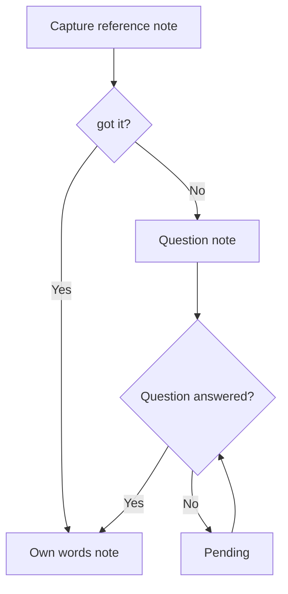
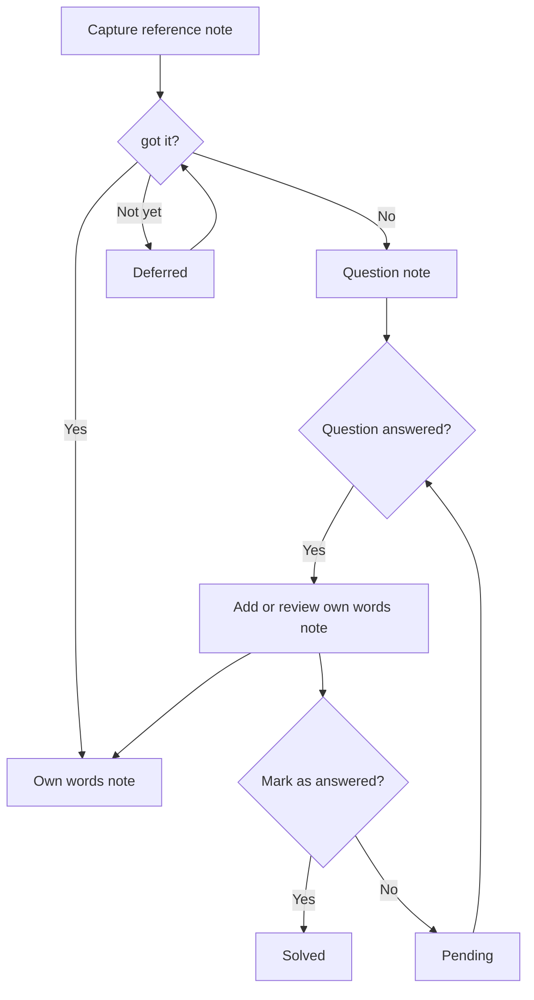

# got it?

## 1. Origin and Personal Need
The idea for this app began with a personal need: organising thoughts and external information - a problem generally addressed by Personal Knowledge Management (PKM) tools. This led to reading <em>How to Take Smart Notes</em> by Sonke Ahrens (2017), which introduced me to the Zettelkasten method: organizing notes into **reference notes** (captured from sources) and **permanent notes** (the reader's own ideas and insights, inspired by a source, but independent of it, with a citation back to the original).

The initial idea was to build something similar to Obsidian, one of the most popular implementations of the Zettelkasten system. When I discovered it already existed, I thought about simplifying it, as it felt too complex, one needed to digest it first. Instead of a system for connecting thoughts and ideas, I would turn it into a tool for assessing the understanding of what is being read, which is simpler to grasp and can be used by younger users as well, particularly secondary school students.

A second observation that reinforced this direction came from my experience as a student in an online, mostly self-guided course. I often find myself reflecting on what I want to ask or what I didn't understand just before the session. Surely one week of self-guided study must generate a lot of questions, but they may go unacknowledged, unformed or unwritten.

This too pointed to the need for a structured way to capture thoughts while learning — with clear decision points that make understanding, or the lack of it, explicit.

## 2. Core Concept and Hypothesis
This would be the core of my app:

**Adopted**
- The idea of distinguishing between different types of notes, adopted from the Zettelkasten system
- The principle of imposing a structured workflow on the note-taking process, adopted from Cornell Notes

**Adopted and verified by existing research**
- Checking understanding by summarising in your own words: if you can explain something simply, you understand it; if you can't, you don't, adopted from the Feynman Technique

**Adapted**
- Literature notes in Zettelkasten system become two types of notes in my app: reference notes and own words notes.

**Extended - product hypothesis, not yet validated**
- A third note category: **question notes** — an explicit, conscious decision to flag something as not yet understood, rather than leaving gaps implicit.  

While not verified by research, this extension is grounded in my experience as a student in self-guided learning context: I write my questions just before the drop-in sessions and these questions do not reflect everything I haven't understood in the previous study week, but having no routine of acknowledging and recording questions, most of them remain as gaps in understanding. This routine is exactly what this app strives to offer and it would reasonably be expected to improve the quality and quantity of questions brought to tutorials, drop-in sessions, or classes — and by extension, the quality of feedback received and understanding achieved.

## 3. Scoping the Full Application
The workflow above, combined with authentication, forms the MVP. However, this being a full stack application meant that I had to get the data model right from the start, which in turn meant thinking about the complete app feature set, not just the MVP. As this application is meant to be user-centric, I first identified my main target audience — secondary school students and above (although the workflow is applicable to any independent learner engaging with source material) — and then set out to understand what users actually expect from a note-taking app.

**Market Research for Landing and Dashboard/Editor**  

I selected four apps representing different approaches to note-taking: a mainstream all-rounder, an AI-first workspace, a linked-thinking tool, and a minimal capture app.
1. OneNote - mainstream app: https://onenote.cloud.microsoft/  

Home Page:  

  

Dashboard:  

  

2. Notion - AI-first, workspace/productivity oriented: https://www.notion.com/notes  

Home Page:  

  

Dashboard:  

  

3. Obsidian -  Zettelkasten, linked thinking,: https://obsidian.md/  

Home Page:  

  

Dashboard:  

  

4. Google Keep - minimal: https://keep.google.com/  

Dashboard:  

  

To complement the visual research, I also drew on an academic article: "Digital Note-Taking: A UX Research Case Study" https://medium.com/@garimamour10/digital-note-taking-a-ux-research-case-study-c5cee728dc8d, and an AI overview, to further inform my design decisions.

**Key Takeaways**  

Note-taking app users expect:
- a minimalist UI,
- a search feature,
- organization by course, or subject, or topic,
- a quick capture mechanism,
- recent notes visibility.

**Anticipating User Behaviour**  

This being a course project, prototype testing was not possible, instead I tried to identify the risks and opportunities that would typically surface through user testing; some I worked out myself while others emerged in my design conversations with Claude AI:
- The binary choice presented to the user after capturing a reference note was the biggest risk identified through my conversations. Users may feel pressured into making a quick decision about their comprehension and this could lead to abandoning the app altogether. From a pedagogical point of view, the Feynman Technique also recognises that understanding is a process, not a moment. So I thought of a third option, defer, as a way of mitigating the identified risk while remaining consistent with the underlying pedagogy.
- One opportunity I identified was to reinforce evaluating information and being selective in capturing notes, by displaying a gentle prompt — 'Is it important?' — at the top of the reference note view, as a passive reminder.  
- Another opportunity  I identified was to give the user the possibility to capture their own ideas and questions related to the study material but not necessarily stemming from a specific reference note, in a default 'My Thoughts' unit created automatically once a course is created.
- Through conversations a question was identified around whether a question note should be automatically marked as answered once linked to an own-words note, or whether that decision should belong to the user. Given that the app is built around conscious comprehension choices, I ruled out automatic resolution — the user should explicitly confirm that they feel the idea is understood.

These considerations informed the following updated workflow diagram:  

With a clearer picture of user expectations from market research and anticipated behaviour risks and opportunities, I wrote user stories covering the complete feature set — not just the MVP — to ensure the data model could support the full application from the start. These can be found in the README and translated into the following features and content requirements.

**Features and Content Requirements**  

1. Authentication
- User registration — email, username, password
- Email verification after registration
- Sign in
- Session persistence (stay logged in between sessions)
- Password reset
- Account deletion with confirmation step

2. Comprehension Workflow
- Capture a reference note
- "Is it important?" passive prompt on reference note view
- "got it?" prompt after saving a reference note — three options: Yes, No, Not yet
- Own-words note with linked reference note and "explain in simple terms" prompt
- Question note with linked reference note,  linked own-words note (optional), status (unanswered/pending/solved)
- Defer option — reference note marked as deferred, returned to later
- "Answer question?" prompt displayed on the view of a saved question note with no linked own-words note
- "Review answer?" — question note with a linked own-words note but not yet marked as solved (pending)
- After saving an own-words note linked to a question note, the student is prompted — 'Mark question as answered?' — moving the question to solved or leaving it as pending
- Note editing and deletion with confirmation step
- Quick capture from dashboard — press plus to capture an own-words or question note immediately, source and unit tagged afterwards

3. Organisation
- Create a source and assign a source type
- Edit source name and source type
- Delete a source with confirmation step (warning that all associated notes will be deleted)
- Default "My Thoughts" unit created automatically when a source is created
- Create a unit within a source
- Rename a unit
- Delete a unit with confirmation step
- View all notes related to a source, organised hierarchically by unit — source expandable into units, units expandable into notes
- View all sources filtered by source type
- Own-words and question notes can be created independently of a reference note

4. Design and Accessibility
- Responsive design across mobile, tablet and desktop
- Accessibility standards compliance
- Consistent navigation across all templates
- Walkthrough/onboarding for new users on the home page

5. Search
- Search notes by keyword
- Results displayed across all note types

6. Tags
- Assign one or more tags to a note
- Prompted with existing tags when tagging to avoid duplicates
- Remove a tag from a note
- View all notes associated with a tag across all sources

## 4. Database Design
I'm using the the "Database Design for Mere Mortals" methodology for designing my database, with the following steps: 
1. **Defining Mission Statement**:  
"The purpose of the "got i?" database is to maintain the data necessary to support users in transforming source material into personal knowledge." 

   **Defining Mission Objectives**: 
- Maintain complete user account information
- Maintain complete source and unit information
- Maintain complete note information
- Maintain complete tag information

2. **Identifying Subjects and Subjects Characteristics**

**Subjects**: User, Course, Unit, Note, Tag 

**Subject Characteristics**: 
 First name, Last name, Email address, Password, Email verification status, Name, Creation date, Last modified date, Course, Unit, Title, Content, Type, Parent note, Creation date;
**Preliminary Field List**: First name, Last name, Email address, Password, Email verification status, Source name, Source date created, Source date last modified, Source type name, Source type date created, Source type date last modified, Parent source, Unit name, Unit type, Unit date created, Unit date last modified, Reference note Parent unit, Reference note title, Reference note content, Reference note date created, Reference note last date modified, Reference note linked status, Own-words note Parent Unit, Own-words title, Own-words content, Own-words date created, Own-words last date modified, Question note Parent Unit, Question Note title, Question Note content, Question Note Date created, Question Note last date modified, Question Note linked status, Question Note answered Status, Tag name, 

 **Note:** During Step 3, the following revisions were made to this subject list. Course was renamed to Source. Source Type was identified as a new subject. Note was split into three separate subjects: Reference Note, Question Note, and Own Words Note.  
 See Step 3 for details.

3. **Establishing Table Structures**

During this step, two revisions were made to the subject list identified in Step 2:

- **Course renamed to Source**: A Course was found to be too prescriptive. Users may organise their notes around a book, a play, a school subject, or any other body of material. Source is a more accurate and neutral term for this top-level container.

- **Source Type identified as a new subject**: Since users have different and personal ways of categorising their sources, a separate Source Type subject was identified to allow each user to define their own classification labels (e.g. "Course", "Textbook", "Play"), rather than having these prescribed by the app.

- **Note split into three subjects**: A single Note subject with a Type field would actually be a multipurpose table. Reference Notes, Question Notes and Own Words Notes each have different data, different rules, and different relationships to one another. They are therefore treated as three distinct subjects.

**Preliminay Table List**: User, Source, Source Type, Unit, Reference Note, Own-Words Note, Question Note, Tag

<h2 align="center">Final Table List</h2>
| Name | Type | Description |
|------|------|-------------|
| User | Data | The people who use the got it? app to take and organise notes while studying. Storing user data allows the app to protect each user's notes and ensure they remain private and accessible only to their owner. |
| Source | Data | The material a user is studying. Storing sources allows users to organise their notes around a specific piece of study material and trace ideas back to where they came from. |
| Source Type | Data | The category or kind of a source. Storing source types allows users to categorise and filter their sources, making it easier to navigate study material across different kinds of resources. |
| Unit | Data | A subsection of a source with a distinct theme. Storing units allows users to refine the scope of their notes and organise them around specific topics or themes within a broader source. |
| Reference Note | Data | A note that captures an idea or passage from the material being studied, preserving the original wording and its source. Storing reference notes allows users to trace ideas back to their origin. |
| Own-words Note | Data | A type of note that reflects the user's understanding of what is being learned. Storing own-words notes allows users to record and revisit their understanding of ideas in their own words, making it easier to identify what has been truly grasped. |
| Question Note | Data | A type of note that reflects the user's gaps in understanding. Storing question notes allows users to keep track of their comprehension gaps, especially when revising, and attempt to clarify them. |
| Tag | Data | A metadata item that links notes by broad theme. Storing tags allows users to organise and retrieve notes across different sources by shared theme, and ensures consistency by making existing tags visible when tagging a note. |

## Resources
### Note-Taking
- Ahrens, Sonke. 2017 How to Take Smart Notes
- Vorderman, Carol. 2016 Help Your Kids with Study Skills
- Michael C. Friedman (October 15, 2014), Notes on Note-Taking: Review of Research and Insights for Students and Instructors, Harvard Initiative for Learning and Teaching, Harvard University, archived from the original (PDF) on February 18, 2018, retrieved January 31, 2018 https://web.archive.org/web/20180218171829/http://hilt.harvard.edu/files/hilt/files/notetaking_0.pdf
- Walter Pauk - How to Study in College (Cornell Notes)

### Learning Theory
- Richard Feynman - the Feynman Technique

### Note-taking apps
- OneNote: https://onenote.cloud.microsoft/
- Notion: https://www.notion.com/notes
- Obsidian: https://obsidian.md/
- Google Keep: https://keep.google.com/

### Digital note taking research:
- https://medium.com/@garimamour10/digital-note-taking-a-ux-research-case-study-c5cee728dc8d

### GitHub
- Conventional-commits-cheatsheet: https://gist.github.com/qoomon/5dfcdf8eec66a051ecd85625518cfd13
- Mermaid diagramming syntax: https://mermaid.js.org
- Project management documentation: https://docs.github.com/en/issues

### Database Design
- Database Design for Mere Mortals by Michael Hernandez
### ERDs
- https://www.lucidchart.com/pages/er-diagrams

## Design
### App Name:
How I found the name for the app? My conversation with Claude AI: https://claude.ai/share/275c93ee-878d-457b-aa82-dfbbb6c5250a

### Design Thinking:
**Questions:**
2. Why do they take notes?
- to remember,
- to organize their thoughts,

Needs: 
- a system to keep track of the ever-increasing pool of information,
- how to deal with complexity,

3. Why do people use note-taking apps?
4. Why would anyone use <em>got it?</em> app?
- a structured workflow,
- at the same time allows flexibility, time for insight, allows you to move further even when you didn't understand,
- a simple structure,
- introduces a routine, so that repeatable tasks become automatic,
- forces to make clear choices,
- promotes focused learning; most distractions come not from our environment, but from our own minds; when you trust the system and know that everything is taken care of you can focus on the task at hand,

**Problem Statements (Who, What, Quality)**
How might we give students a clear, repeatable routine for turning course material into knowledge they actually understand?

**Find the MVP user stories**
What is the minimum the app needs to do to be useful?

**Choosing the main target audience**
The app will target mainly secondary school students and above.

Thinking about how I will develop my app, at this point I can safely say I have two basic entities: the user and the notes with a one to many relationship.

The basic user story is: As a student, I want to take notes to .... The reasons behind note taking will determine specific user stories, functionality, entities, etc.

**Epics**
1. As a student, I need a learning companion that helps me stay focused while learning, so that I instill good studying habits.

**User Stories** still to consider from Claude AI - full conversation: https://claude.ai/share/7bb57a15-6da5-43ae-9f56-2aa1c2f5357a
- You don't have a story for the dashboard/home view once logged in — what does a student see first when they open the app?
- The course entity appears implicitly in several stories ("related to a particular course") but you haven't written a story specifically about creating or managing courses. That's likely an entity in your ERD that needs its own CRUD stories.
- The link between own words notes/question notes and reference notes is mentioned but the navigation around that relationship — how a student actually moves between linked notes — isn't captured in any story.

