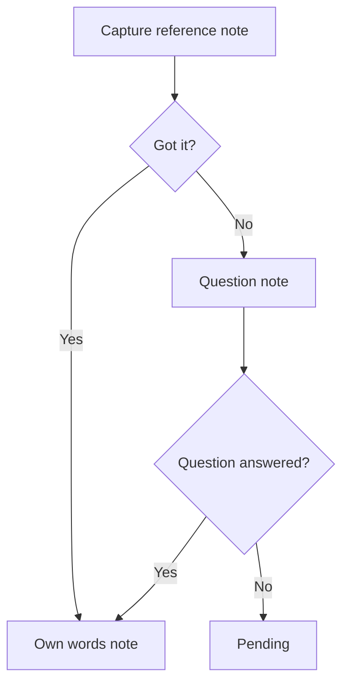
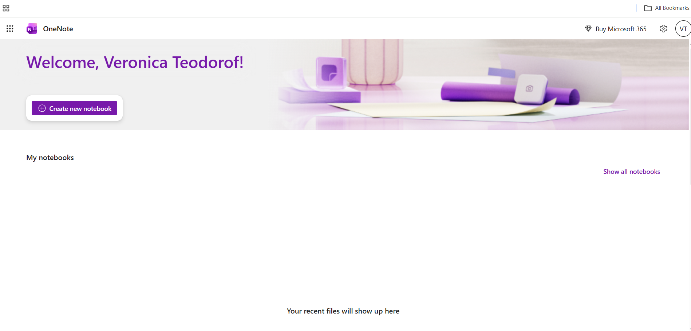
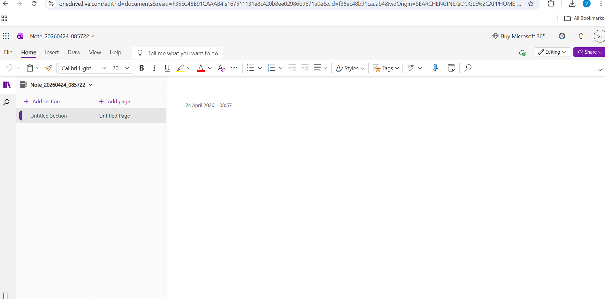
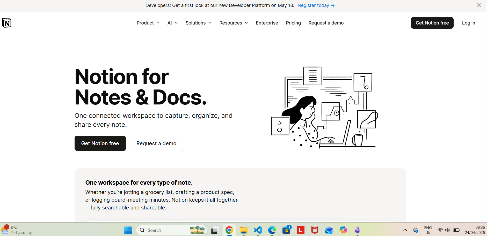
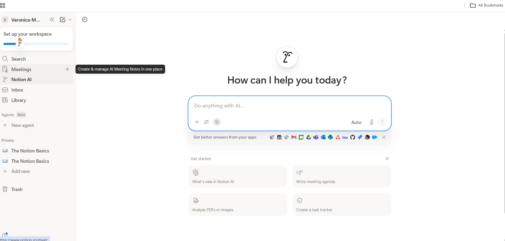
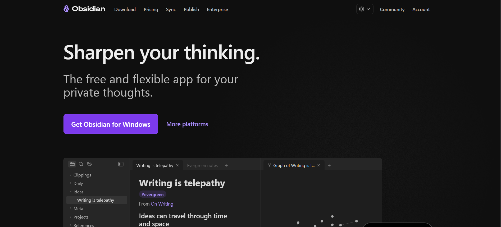
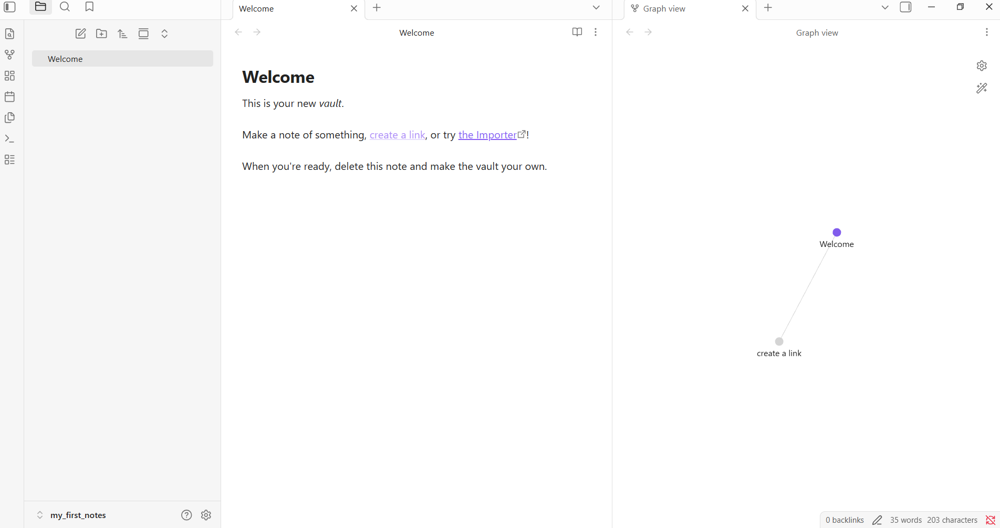
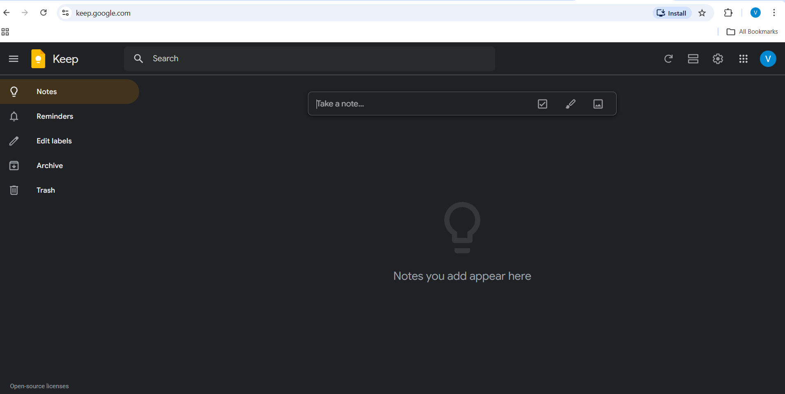

# got it?

## 1. Origin and Personal Need
The idea for this app began with a personal need: organising thoughts and external information - a problem generally addressed by Personal Knowledge Management (PKM) tools.

This led to reading <em>How to Take Smart Notes</em> by Sonke Ahrens (2017), which introduced the Zettelkasten method: organizing notes into **reference notes** (captured from sources) and **permanent notes** (the reader's own ideas and insights, inspired by a source, but independent of it, with a citation back to the original).

Initial idea was to build something similar to Obsidian, one of the most popular implementations of the Zettelkasten system. On discovering it already existed, I thought about simplifying it, as I felt it was too complex, one needed to digest it first. Instead of a system for connecting thoughts and ideas, I would turn it into a tool for assessing the understanding of what is being read, which is simpler to grasp and can be used by younger users as well, particularly secondary school students.

A second observation that reinforced this direction came from my own experience as a student in an online, mostly self-guided course. We have a weekly drop-in session that is very poorly attended. When students do come, they have very few questions; even I find myself reflecting on what I want to ask or what I didn't understand just before the session. Surely one week of self-guided study must generate a lot of questions, but they are unacknowledged, unformed and unwritten.

This too pointed to the need for a structured way to capture thoughts while learning — with clear decision points that make understanding, or the lack of it, explicit.

## 2. Core Concept and Hypothesis
This would be the core of my app:

**Adopted**
- The idea of distinguishing between different types of notes, adopted from the Zettelkasten system
- Cornell Notes — the principle of imposing a structured workflow on the note-taking process

**Adopted and verified by existing research**
- The Feynman Technique — checking understanding by summarising in your own words: if you can explain something simply, you understand it; if you can't, you don't

**Adapted**
- Literature notes in Zettelkasten system become two types of notes in my app: reference notes and own words notes.

**Extended - product hypothesis, not yet validated**
- A third note category: **question notes** — an explicit, conscious decision to flag something as not yet understood, rather than leaving gaps implicit. 
While not verified by research, this extension is grounded in a personal observation: students in self-guided learning contexts often arrive at feedback sessions without formed questions, not necessarily because they have none, but possibly because they have no routine of evaluating their understanding of what is being learned. This routine is exactly what this app strives to offer and it would reasonably be expected to improve the quality of questions brought to tutorials, drop-in sessions, or classes — and by extension, the quality of feedback received and understanding achieved.

## Resources
### Note-Taking
- Ahrens, Sonke. 2017 How to Take Smart Notes
- Vorderman, Carol. 2016 Help Your Kids with Study Skills
- Michael C. Friedman (October 15, 2014), Notes on Note-Taking: Review of Research and Insights for Students and Instructors, Harvard Initiative for Learning and Teaching, Harvard University, archived from the original (PDF) on February 18, 2018, retrieved January 31, 2018 https://web.archive.org/web/20180218171829/http://hilt.harvard.edu/files/hilt/files/notetaking_0.pdf
- Walter Pauk - How to Study in College (Cornell Notes)

### Learning Theory
- Richard Feynman - the Feynman Technique

### Note-taking apps
- OneNote: https://onenote.cloud.microsoft/
- Notion: https://www.notion.com/notes
- Obsidian: https://obsidian.md/
- Google Keep: https://keep.google.com/

### Digital note taking research:
- https://medium.com/@garimamour10/digital-note-taking-a-ux-research-case-study-c5cee728dc8d

### GitHub
- Conventional-commits-cheatsheet: https://gist.github.com/qoomon/5dfcdf8eec66a051ecd85625518cfd13
- Mermaid diagramming syntax: https://mermaid.js.org

## Design
### App Name:
How I found the name for the app? My conversation with Claude AI: https://claude.ai/share/275c93ee-878d-457b-aa82-dfbbb6c5250a

### Design Thinking:
**Questions:**
1. Who takes notes?
- students
- professors
- nonfiction writers
2. Why do they take notes?
- to remember,
- to organize their thoughts,

Needs: 
- a system to keep track of the ever-increasing pool of information,
- how to deal with complexity,

3. Why do people use note-taking apps?
4. Why would anyone use <em>got it?</em> app?
- a structured workflow,
- at the same time allows flexibility, time for insight, allows you to move further even when you didn't understand,
- a simple structure,
- introduces a routine, so that repeatable tasks become automatic,
- forces to make clear choices,
- promotes focused learning; most distractions come not from our environment, but from our own minds; when you trust the system and know that everything is taken care of you can focus on the task at hand,

5. What do people expect from a note-taking app?
Key takeways from https://medium.com/@garimamour10/digital-note-taking-a-ux-research-case-study-c5cee728dc8d, that I could use in my app:
- **Organization and Categorization:**  Users should be able to organize their notes effectively through features such as folders, tags, or categories, allowing for easy navigation and retrieval of specific notes.
- **Search Functionality:** A robust search feature enables users to quickly find specific notes by searching for keywords or phrases.
- **Intuitive and Familiar Interface:** Users should be able to navigate and use the app effortlessly, without the need for extensive learning or guidance.

From AI overview: 
- 1. Instant "Capture" Functionality
- A Blank Note or New Note Button: A prominent "plus" (+) button or a completely blank note to immediately start typing or writing.
- Recent Notes: A list of recent or pinned notes, allowing users to pick up where they left off.
- Minimalist Interface: A clean, distraction-free design that focuses on the content rather than the tool itself

- 2. Immediate Organization and Search
- Search Bar: A highly visible, robust search feature to find old notes instantly by keyword.
- Folders or Tags: Clear access to existing structures (notebooks, folders, or tags) to categorize notes.
- "All Notes" View: A default, chronological list of all created notes.

**Problem Statements (Who, What, Quality)**
How might we give students a clear, repeatable routine for turning course material into knowledge they actually understand?

**Find the MVP user stories**
What is the minimum the app needs to do to be useful?

**Choosing the main target audience**
The app will target mainly secondary school students and above.

Thinking about how I will develop my app, at this point I can safely say I have two basic entities: the user and the notes with a one to many relationship.

The basic user story is: As a student, I want to take notes to .... The reasons behind note taking will determine specific user stories, functionality, entities, etc.

**Epics**
1. As a student, I need a learning companion that helps me stay focused while learning, so that I instill good studying habits.

**User Stories** still to consider from Claude AI - full conversation: https://claude.ai/share/7bb57a15-6da5-43ae-9f56-2aa1c2f5357a
- You don't have a story for the dashboard/home view once logged in — what does a student see first when they open the app?
- The course entity appears implicitly in several stories ("related to a particular course") but you haven't written a story specifically about creating or managing courses. That's likely an entity in your ERD that needs its own CRUD stories.
- The link between own words notes/question notes and reference notes is mentioned but the navigation around that relationship — how a student actually moves between linked notes — isn't captured in any story.

**Market Research for Landing and Dashboard/Editor** 
I've done some market research to find out what a note-taking app user expects to see when they first open the app and when they want to start working:

1. OneNote - mainstream app: https://onenote.cloud.microsoft/ 
Home Page: 
 
Dashboard: 
 

2. Notion - AI-first, workspace/productivity oriented: https://www.notion.com/notes  
Home Page: 
 
Dashboard: 
 

3. Obsidian -  Zettelkasten, linked thinking,: https://obsidian.md/ 
Home Page:  
 
Dashboard:  
 

4. Google Keep - minimal: https://keep.google.com/ 
Dashboard: 
 
